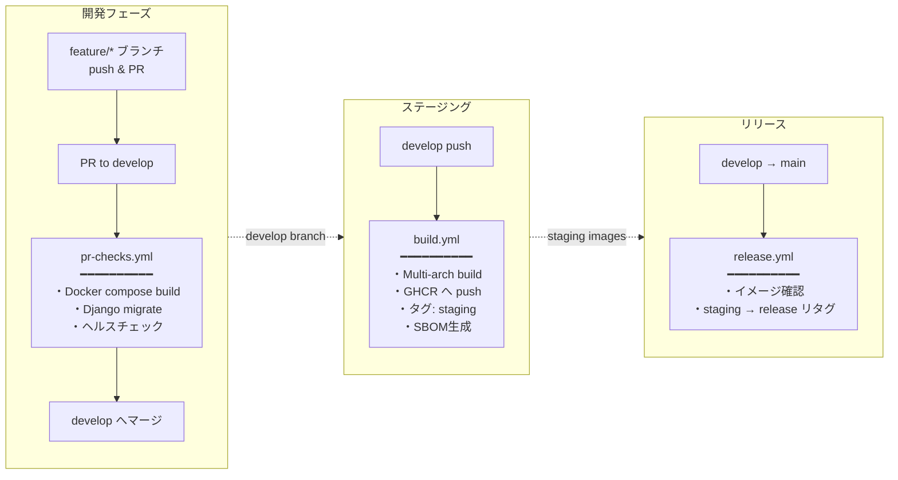

# 鍵山製パン社内 Web システム

[](https://www.docker.com/)
[](https://docs.docker.com/compose/)
[](https://github.com/features/actions)

## 概要

Docker コンテナベースの Web サービス群です。アプリケーションの開発・ビルド・テストに専念するリポジトリです。

## サービス

- 🐍 **Django API**: REST API で複数の機能を提供するバックエンドサーバ
    - 🔐 **User**: ユーザー認証・管理機能
    - ☁️ **OneDrive**: Microsoft OneDrive との統合機能（ファイルアップロード・管理）
    - 📅 **Outlook**: Outlook Calendar 予定取得機能
    - 📁 **Media**: メディアファイル管理機能
    - 🔊 **TTS**: テキスト読み上げ機能（Style-BERT-VITS2 プロキシ）
    - 🌤️ **Weather**: 気象庁天気予報 API（今日・明日・明後日の天気、気温、降水確率）
    - 🎙️ **Greeting**: 挨拶 API（設定ベースの柔軟な挨拶生成、天気・予定・日時情報を選択可能、TTS 音声合成対応）
    - 🤖 **LLM Client**: OpenAI API クライアント（テキスト生成）
    - 🔧 **LLM Config**: LLM 設定管理
    - 🔗 **MS Graph Config**: Microsoft Graph API 共通設定・認証モジュール
    - 🔗 **MS Graph Client**: OneDrive/Outlook 統一クライアント
    - 🛠️ **Core**: 共通機能・ユーティリティ
- 🎤 **Style-BERT-VITS2 API**: 高品質な日本語音声合成サービス

## 特徴

- 🚀 **CI/CD**: GitHub Actions による自動ビルド・テスト・リリース
- 📦 **コンテナレジストリ**: GitHub Container Registry へのイメージ公開
- 🔐 **ビルド証明**: SLSA Build Provenance による信頼性の担保
- 📋 **SBOM**: ソフトウェア部品表（CycloneDX）の自動生成
- 🛡️ **脆弱性スキャン**: Trivy によるイメージ検査
- 💾 **自動バックアップ**: OneDrive への定期バックアップ機能
- 🔒 **暗号化**: 機密情報の暗号化保存（OneDrive 設定など）
- 🐍 **最新 Python 環境**: uv を使用した高速なパッケージ管理
- ✅ **テストカバレッジ**: pytest によるテスト自動化とカバレッジ計測

## プロジェクト構成

```
kawashiro-server/
├── docker-compose.yml          # 開発用のDocker Compose設定
├── docker-compose.backup.yml   # バックアップコンテナ用のDocker Compose設定
├── README.md                   # このファイル
│
├── .github/                    # GitHub設定
│   ├── workflows/              # GitHub Actionsワークフロー
│   │   ├── build.yml           # ビルド・プッシュ（develop）
│   │   ├── release.yml         # リリースタグ付け（main）
│   │   ├── pr-checks.yml       # PRチェック
│   │   └── cleanup-images.yml  # 古いイメージのクリーンアップ
│   └── copilot-instructions.md # Copilotレビュー設定
│
├── django_api/                 # Django REST API
│   ├── Dockerfile              # Django APIコンテナ
│   ├── pyproject.toml          # Python依存関係（uv使用）
│   ├── manage.py               # Djangoコマンド
│   ├── pytest.ini              # pytestの設定
│   ├── django_api/             # メインプロジェクト
│   │   ├── settings.py         # Django設定
│   │   ├── urls.py             # URLルーティング
│   │   ├── asgi.py             # ASGIエントリーポイント
│   │   └── wsgi.py             # WSGIエントリーポイント
│   ├── user/                   # ユーザー認証アプリ
│   ├── onedrive/               # OneDrive統合アプリ
│   ├── outlook/                # Outlook Calendar予定取得アプリ
│   ├── media/                  # メディアファイル管理アプリ
│   ├── core/                   # 共通コアアプリ（暗号化ユーティリティ等）
│   ├── tts/                    # TTS読み上げアプリ（sbv2-apiプロキシ）
│   ├── weather/                # 気象庁天気予報アプリ
│   ├── greeting/               # 挨拶アプリ（設定ベースのAI挨拶生成・TTS対応）
│   ├── llm_client/             # OpenAI APIクライアント
│   ├── llm_config/             # LLM設定管理
│   ├── msgraph_client/         # Microsoft Graph統一クライアント
│   ├── msgraph_config/         # Microsoft Graph設定・認証管理
│   ├── tests/                  # 統合テストコード
│   └── htmlcov/                # カバレッジレポート
│
├── sbv2_api/                   # Style-BERT-VITS2 APIサーバー
│   ├── Dockerfile              # コンテナ定義
│   ├── server.py               # FastAPIサーバー
│   └── config.yml              # モデル設定
│
├── backup/                     # バックアップシステム
│   ├── Dockerfile              # バックアップコンテナ
│   ├── pyproject.toml          # Python依存関係（uv使用）
│   ├── README.md               # バックアップ詳細ドキュメント
│   ├── scripts/                # バックアップスクリプト（Python）
│   │   ├── backup_all.py       # 統合バックアップスクリプト
│   │   └── backup_django.py    # Django APIバックアップ
│   └── tests/                  # テストコード
│
├── docs/                       # ドキュメント
│   └── archtecture.drawio      # アーキテクチャ図
│
└── volumes/                    # 永続化データ
    └── backup/                 # バックアップ出力先
```

## 必要な環境

- Docker Engine 20.10.0+
- Docker Compose 2.0.0+

## インストール・セットアップ

### 1. リポジトリのクローン

```bash
git clone https://github.com/kagiyama-baking/kawashiro-server.git
cd kawashiro-server
```

### 2. 環境変数の設定

```bash
# 環境変数ファイルの作成
cp .env.example .env

# .envファイルを編集して必要な値を設定
nano .env
```

### 3. サーバーの起動

```bash
# すべてのサービスを起動
docker compose up -d

# ログを確認
docker compose logs -f
```

### 4. 動作確認

```bash
# Django API ヘルスチェック
curl http://localhost:8000/schema/
```

## 環境変数設定

### 必須の環境変数

`.env`ファイルに以下の環境変数を設定してください：

```bash
# タイムゾーン
TZ=Asia/Tokyo               # システムタイムゾーン
```

### Django API 設定

Django API を使用する場合は、`django_api/.env`ファイルに以下の環境変数を設定してください：

```bash
# Django設定
SECRET_KEY=YOUR_SECRET_KEY
DEBUG=False
ALLOWED_HOSTS=localhost,127.0.0.1

# データベースに保存する機密情報の暗号化に使用
# 本番環境では十分にランダムな文字列を設定してください
ENCRYPTION_KEY=YOUR_ENCRYPTION_KEY

# Microsoft Graph API（OneDrive/Outlook統合機能）
AZURE_TENANT_ID=your-tenant-id
AZURE_CLIENT_ID=your-client-id
AZURE_CLIENT_SECRET=your-client-secret

# OpenAI API（挨拶機能などのAI生成に使用）
OPENAI_API_KEY=your-openai-api-key

# Style-BERT-VITS2 API（音声合成機能）
TTS_SERVICE_URL=http://sbv2-api:5000
```

### バックアップシステム設定

バックアップを使用する場合は、`.env.backup`ファイルを作成して以下の環境変数を設定してください：

```bash
# Django API設定
DJANGO_API_URL=http://django-api:8000
DJANGO_API_TOKEN=your-api-token

# OneDriveバックアップ設定
DJANGO_ONEDRIVE_BACKUP_PATH=/Backup/kawashiro-server

# バックアップオプション
BACKUP_RETENTION_GENERATIONS=7         # 保持する世代数
TZ=Asia/Tokyo                          # タイムゾーン
```

## 使用方法

### サービスの管理

```bash
# 開発環境: サービスの起動
docker compose up -d

# バックアップコンテナの実行
docker compose -f docker-compose.backup.yml run --rm backup python /app/scripts/backup_all.py

# サービスの停止
docker compose down

# サービスの再起動
docker compose restart
```

### バックアップの実行

```bash
# Django APIをバックアップ
docker compose -f docker-compose.backup.yml run --rm backup python /app/scripts/backup_all.py
```

### ログの確認

```bash
# 全サービスのログ
docker compose logs -f

# 特定のサービスのログ
docker compose logs -f django-api

# バックアップログ
docker compose -f docker-compose.backup.yml logs backup
```

## CI/CD

### デプロイメントパイプライン

本プロジェクトでは、GitHub Actions を活用した 3 段階のデプロイメントパイプラインを構築しています。
本番デプロイは [internal.kagiyama.net](https://github.com/kagiyama-baking/internal.kagiyama.net)（Ansible）が担当します。

### GitHub Actions ワークフロー



### ワークフロー詳細

#### 1. PR チェック (`pr-checks.yml`)

**トリガー条件:**

- `develop`ブランチへの Pull Request 作成・更新時
- 手動実行（`workflow_dispatch`）

**実行内容:**

```yaml
# 主要なチェック項目
- Docker Composeビルド検証
- Django APIのマイグレーションテスト
- 静的ファイル収集テスト
- ヘルスチェックエンドポイント確認
```

**タイムアウト:** 15 分

#### 2. ビルド・プッシュ (`build.yml`)

**トリガー条件:**

- `develop`ブランチへのプッシュ時
- 手動実行（`workflow_dispatch`）

**実行内容:**

```yaml
# ビルド対象サービス
services:
  - django-api
  - backup

# 各サービスに対して実行
- マルチアーキテクチャビルド (linux/amd64, linux/arm64)
- GitHub Container Registry (GHCR) へプッシュ
- SBOM (Software Bill of Materials) 生成
- Build Provenance (SLSA Level 3) 添付
```

**生成されるタグ:**

- `staging` - 最新のステージングビルド
- `sha-<7文字のSHA>` - コミット固有のタグ

**タイムアウト:** 30 分

#### 3. リリース (`release.yml`)

**トリガー条件:**

- `main`ブランチへのプッシュ時
- 手動実行

**実行内容:**

```yaml
# リリースフロー
1. verify-images: stagingイメージの存在確認
2. tag-release: staging → release/latest リタグ
3. summary: リリースサマリー出力
```

**本番タグ:**

- `release` - 本番環境用の最新リリース
- `latest` - 最新版（互換性のため）

### コンテナイメージのタグ戦略

| タグ           | 用途             | 更新タイミング                 |
| -------------- | ---------------- | ------------------------------ |
| `staging`      | ステージング環境 | develop ブランチへのプッシュ時 |
| `release`      | 本番環境         | main ブランチへのマージ時      |
| `latest`       | 最新版（互換性） | main ブランチへのマージ時      |
| `sha-<commit>` | 特定バージョン   | 各ビルド時                     |

### ロールバック手順

問題が発生した場合のロールバック：

```bash
# 特定のSHAタグを使用してロールバック
docker pull ghcr.io/kagiyama-baking/kawashiro-server/django-api:sha-abc1234

# Ansible側でタグを指定してデプロイ
```

### ブランチ保護ルール

#### develop ブランチ

- PR が必須
- ステータスチェック必須（pr-checks）
- レビュー承認が必要
- 直接プッシュ禁止

#### main ブランチ

- PR が必須
- develop からのマージのみ許可
- 管理者承認が必要
- タグ付けは自動化

### CI/CD 環境変数

GitHub Secrets に設定が必要な環境変数：

```yaml
# 必須（自動設定）
GITHUB_TOKEN: ${{ github.token }}
```

## トラブルシューティング

### よくある問題と解決方法

#### 1. コンテナが起動しない

```bash
# コンテナの状態を確認
docker compose ps

# 詳細なログを確認
docker compose logs -f [サービス名]

# 原因と対処法
# - ポート競合: 他のサービスが8000番ポートを使用していないか確認
#   sudo lsof -i :8000
# - メモリ不足: Docker のメモリ制限を確認
#   docker system info | grep Memory
```

#### 2. ディスク容量不足

```bash
# Dockerが使用している容量を確認
docker system df

# 不要なイメージ・コンテナを削除
docker system prune -a --volumes

# ログファイルのサイズを確認
du -sh ./volumes/*/log/
```

#### 3. パーミッションエラー

```bash
# ボリュームディレクトリの所有者を修正
sudo chown -R $USER:$USER ./volumes/

# 実行権限を付与（スクリプトの場合）
chmod +x ./scripts/*.sh
```

### ログの確認方法

```bash
# 全サービスのログをリアルタイム表示
docker compose logs -f

# 特定期間のログを表示（最新100行）
docker compose logs --tail=100

# エラーログのみ抽出
docker compose logs 2>&1 | grep -i error

# ログをファイルに保存
docker compose logs > logs_$(date +%Y%m%d_%H%M%S).txt
```

## セキュリティ設定

### 環境変数のセキュリティ

```bash
# .envファイルの権限を制限
chmod 600 .env

# Gitに.envファイルが含まれていないことを確認
git status --ignored
```

### イメージの署名と検証

```bash
# Build Provenanceの確認
gh attestation verify oci://ghcr.io/kagiyama-baking/kawashiro-server/django-api:staging \
  --owner kagiyama-baking

# 脆弱性スキャン
trivy image ghcr.io/kagiyama-baking/kawashiro-server/django-api:staging
```

## 開発者向けガイド

### 開発環境のセットアップ

```bash
# 開発用ブランチの作成
git checkout -b feature/your-feature-name

# 開発環境の起動
docker compose up -d
```

### テストの実行

```bash
# Django APIテスト
cd django_api
uv run pytest tests/ -v --tb=short \
  --cov=user --cov=onedrive --cov=outlook --cov=core \
  --cov-report=term-missing -m "not e2e"

# バックアップテスト
cd backup
uv run pytest tests/ -v --tb=short \
  --cov=scripts --cov-report=term-missing
```

### コーディング規約

- Dockerfile はベストプラクティスに従う
- 環境変数は大文字とアンダースコア
- ドキュメントは日本語で記述

## 技術スタック

### バックエンド

- **Django**: Python Web フレームワーク
- **Django REST Framework**: REST API 構築
- **Gunicorn**: WSGI HTTP サーバー（本番環境）
- **SQLite**: 軽量データベース（Django API 用）

### インフラ・DevOps

- **Docker & Docker Compose**: コンテナ化とオーケストレーション
- **Traefik**: リバースプロキシ（internal.kagiyama.net で管理）
- **GitHub Actions**: CI/CD パイプライン
- **GitHub Container Registry**: コンテナイメージレジストリ

### ツール・ユーティリティ

- **uv**: 高速 Python パッケージマネージャー
- **pytest**: Python テストフレームワーク
- **Ruff**: Python リンター・フォーマッター
- **Trivy**: コンテナセキュリティスキャナー

### 外部サービス連携

- **Microsoft Graph API**: OneDrive/Outlook 連携
- **OpenAI API**: テキスト生成（挨拶機能）
- **気象庁天気予報 API**: 天気予報データ取得
- **Style-BERT-VITS2**: 高品質日本語音声合成エンジン

## 謝辞

このプロジェクトは以下のオープンソースプロジェクト・サービスを使用しています：

- [Django](https://www.djangoproject.com/) - Python Web フレームワーク
- [Docker](https://www.docker.com/) - コンテナ化プラットフォーム
- [uv](https://github.com/astral-sh/uv) - 高速 Python パッケージマネージャー
- [Style-BERT-VITS2](https://github.com/litagin02/Style-Bert-VITS2) - 高品質日本語音声合成エンジン
- [OpenAI](https://openai.com/) - AI テキスト生成 API
