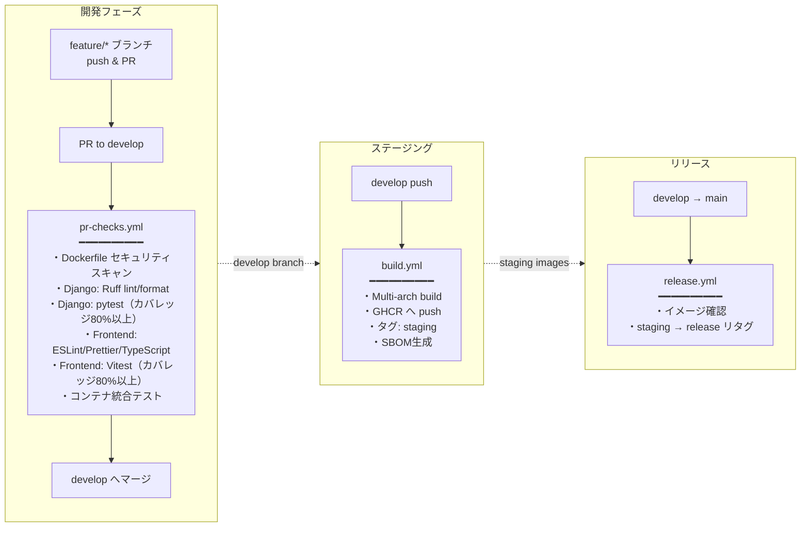

# 鍵山製パン社内 Web アプリケーション

[](https://www.docker.com/)
[](https://docs.docker.com/compose/)
[](https://github.com/features/actions)

## 概要

Docker コンテナベースの Web アプリケーションです。
React SPA フロントエンドと Django REST API バックエンドで構成されています。
本番環境のデプロイとリバースプロキシ（Traefik）は [internal.kagiyama.net](https://github.com/kagiyama-baking/internal.kagiyama.net) リポジトリ（Ansible）が管理します。

## サービス

- 🌐 **Frontend**: React SPA（テキスト読み上げ・会話生成・メディア変換の操作画面）
- 🐍 **Django API**: REST API で複数の機能を提供するバックエンドサーバ
    - 🔐 **User**: ユーザー認証・管理機能
    - **integrations/** - 外部サービス連携
        - 🤖 **LLM**: OpenAI API 設定・クライアント（会話生成）
        - 🔗 **MS Graph**: Microsoft Graph API 設定・認証・クライアント
        - ☁️ **OneDrive**: Microsoft OneDrive との統合機能（ファイルアップロード・管理）
        - 📅 **Outlook**: Outlook Calendar 予定取得機能
        - 🔊 **TTS**: テキスト読み上げ機能（Style-BERT-VITS2 プロキシ）
        - 🌤️ **Weather**: 気象庁天気予報 API（今日・明日・明後日の天気、気温、降水確率）
    - **features/** - ビジネス機能
        - 🎙️ **Talk**: 会話生成 API（設定ベースの柔軟な会話生成、天気・予定・日時情報を選択可能、TTS 音声合成対応）
        - 📁 **Media**: メディアファイル管理機能（画像フォーマット変換、ZIP→PDF変換）
- 🎤 **Style-BERT-VITS2 API**: 高品質な日本語音声合成サービス（GPU対応）

## 特徴

- 🌐 **モダン SPA**: React 19 + TypeScript + Tailwind CSS v4 + shadcn/ui
- 🚀 **CI/CD**: GitHub Actions による自動ビルド・テスト・リリース
- 📦 **コンテナレジストリ**: GitHub Container Registry へのイメージ公開
- 🔐 **ビルド証明**: SLSA Build Provenance による信頼性の担保
- 📋 **SBOM**: ソフトウェア部品表（CycloneDX）の自動生成
- 🛡️ **脆弱性スキャン**: Trivy によるイメージ検査
- 🔒 **暗号化**: 機密情報の暗号化保存（OneDrive 設定など）
- ✅ **テスト**: pytest（バックエンド）+ Vitest + Playwright（フロントエンド）

## プロジェクト構成

```
kawashiro-server/
├── docker-compose.yml          # 開発用のDocker Compose設定
├── README.md                   # このファイル
│
├── .github/                    # GitHub設定
│   └── workflows/              # GitHub Actionsワークフロー
│       ├── build.yml           # ビルド・プッシュ（develop）
│       ├── release.yml         # リリースタグ付け（main）
│       ├── pr-checks.yml       # PRチェック
│       └── cleanup-images.yml  # 古いイメージのクリーンアップ
│
├── frontend/                   # React SPA フロントエンド
│   ├── Dockerfile              # マルチステージビルド（node → nginx）
│   ├── nginx.conf              # SPA配信 + APIプロキシ
│   ├── package.json            # 依存関係（pnpm）
│   ├── src/
│   │   ├── components/         # UIコンポーネント
│   │   ├── features/           # 画面（home, login, tts, talk, media）
│   │   ├── lib/                # APIクライアント
│   │   ├── stores/             # Zustand ストア
│   │   └── types/              # 型定義
│   ├── tests/                  # Vitest ユニットテスト
│   └── e2e/                    # Playwright E2E テスト
│
├── django_api/                 # Django REST API
│   ├── Dockerfile              # Python 3.13-alpine ベース
│   ├── pyproject.toml          # Python依存関係（uv使用）
│   ├── django_api/             # メインプロジェクト設定
│   ├── core/                   # コアアプリ（カスタムUserモデル、暗号化）
│   ├── user/                   # ユーザー認証アプリ
│   ├── health/                 # ヘルスチェックアプリ
│   ├── integrations/           # 外部サービス連携
│   │   ├── llm/                # LLM設定・クライアント（OpenAI API）
│   │   ├── msgraph/            # Microsoft Graph API設定・クライアント
│   │   ├── onedrive/           # OneDrive連携API
│   │   ├── outlook/            # Outlook Calendar連携API
│   │   ├── tts/                # TTS読み上げ（sbv2-apiプロキシ）
│   │   └── weather/            # 気象庁天気予報
│   ├── features/               # ビジネス機能
│   │   ├── talk/               # 会話生成（LLM + 天気 + 予定 + TTS統合）
│   │   └── media/              # 画像処理（ZIP→PDF変換、画像形式変換）
│   └── tests/                  # テストコード
│
└── sbv2_api/                   # Style-BERT-VITS2 APIサーバー（GPU）
    ├── Dockerfile              # コンテナ定義（CUDA 11.8）
    ├── server.py               # FastAPIサーバー
    └── config.yml              # モデル設定
```

## 必要な環境

- Docker Engine 20.10.0+
- Docker Compose 2.0.0+
- NVIDIA GPU + [NVIDIA Container Toolkit](https://docs.nvidia.com/datacenter/cloud-native/container-toolkit/latest/install-guide.html)（sbv2-api 用）

## インストール・セットアップ

### 1. リポジトリのクローン

```bash
git clone https://github.com/kagiyama-baking/kawashiro-server.git
cd kawashiro-server
```

### 2. 環境変数の設定

```bash
cp django_api/.env.sample django_api/.env
nano django_api/.env
```

### 3. 永続化ディレクトリの準備

```bash
sudo mkdir -p /opt/app/django-api/staticfiles
sudo touch /opt/app/django-api/db.sqlite3
sudo chown -R $USER:$USER /opt/app/
```

### 4. サーバーの起動

```bash
# すべてのサービスを起動
docker compose up -d

# ログを確認
docker compose logs -f
```

### 5. 動作確認

```bash
# Django API ヘルスチェック
curl http://localhost:8000/health/

# フロントエンド（Docker）
curl http://localhost:3000/

# フロントエンド（開発サーバー）
cd frontend && pnpm install && pnpm dev
# http://localhost:5173/ でアクセス
```

## 環境変数設定

### Django API 設定

`django_api/.env` ファイルに以下の環境変数を設定してください（`.env.sample` を参照）：

```bash
# Django設定（必須）
SECRET_KEY=YOUR_SECRET_KEY

# デバッグモード（デフォルト: False）
DEBUG=False

# 許可ホスト（カンマ区切り、デフォルト: localhost）
ALLOWED_HOSTS=localhost,127.0.0.1

# データベースに保存する機密情報の暗号化に使用
ENCRYPTION_KEY=YOUR_ENCRYPTION_KEY

# Style-BERT-VITS2 API（デフォルト: http://sbv2-api:5000）
TTS_SERVICE_URL=http://sbv2-api:5000

# リバースプロキシ経由時のCSRF信頼済みオリジン（本番環境用）
CSRF_TRUSTED_ORIGINS=https://api.example.com
```

その他の設定（Microsoft Graph API、OpenAI API キーなど）は Django 管理画面（`/admin/`）から設定します。

## 使用方法

### サービスの管理

```bash
# サービスの起動
docker compose up -d

# サービスの停止
docker compose down

# サービスの再起動
docker compose restart
```

### ログの確認

```bash
# 全サービスのログ
docker compose logs -f

# 特定のサービスのログ
docker compose logs -f django-api
docker compose logs -f frontend
```

## CI/CD

### デプロイメントパイプライン

本プロジェクトでは、GitHub Actions を活用した 3 段階のデプロイメントパイプラインを構築しています。
本番デプロイは [internal.kagiyama.net](https://github.com/kagiyama-baking/internal.kagiyama.net)（Ansible）が担当します。

### GitHub Actions ワークフロー



### ビルド対象サービス

| サービス     | PRチェック | ビルド・プッシュ | リリース |
| ------------ | ---------- | ---------------- | -------- |
| django-api   | ✓          | ✓                | ✓        |
| frontend     | ✓          | ✓                | ✓        |
| sbv2-api     | スキャンのみ | -              | -        |

> **Note:** `sbv2-api` は NVIDIA GPU が必須のため、CI 環境ではビルド・テストを実行しません。Dockerfileのセキュリティスキャンのみ行います。

### コンテナイメージのタグ戦略

| タグ           | 用途             | 更新タイミング                 |
| -------------- | ---------------- | ------------------------------ |
| `staging`      | ステージング環境 | develop ブランチへのプッシュ時 |
| `release`      | 本番環境         | main ブランチへのマージ時      |
| `latest`       | 最新版（互換性） | main ブランチへのマージ時      |
| `sha-<commit>` | 特定バージョン   | 各ビルド時                     |

## テストの実行

### バックエンド（Django API）

```bash
cd django_api
uv run pytest tests/ -v --tb=short \
  --cov=user --cov=core --cov=integrations --cov=features \
  --cov-report=term-missing -m "not e2e"
```

### フロントエンド

```bash
cd frontend
pnpm test:ci       # ユニットテスト（カバレッジ付き）
pnpm test:e2e      # E2Eテスト（Playwright）
```

## 技術スタック

### フロントエンド

- **React 19**: UI ライブラリ
- **Vite**: ビルドツール
- **TypeScript**: 型安全な JavaScript
- **Tailwind CSS v4**: ユーティリティファースト CSS
- **shadcn/ui**: UI コンポーネントライブラリ
- **Zustand**: 状態管理
- **ky**: HTTP クライアント

### バックエンド

- **Django 6.0**: Python Web フレームワーク
- **Django REST Framework**: REST API 構築
- **SQLite**: 軽量データベース
- **uv**: 高速 Python パッケージマネージャー

### インフラ・DevOps

- **Docker & Docker Compose**: コンテナ化とオーケストレーション
- **nginx**: フロントエンド配信 + API プロキシ
- **Traefik**: リバースプロキシ（internal.kagiyama.net で管理）
- **GitHub Actions**: CI/CD パイプライン
- **GitHub Container Registry**: コンテナイメージレジストリ
- **Trivy**: コンテナセキュリティスキャナー

### 外部サービス連携

- **Microsoft Graph API**: OneDrive/Outlook 連携
- **OpenAI API**: 会話生成
- **気象庁天気予報 API**: 天気予報データ取得
- **Style-BERT-VITS2**: 高品質日本語音声合成エンジン（CUDA 11.8）
