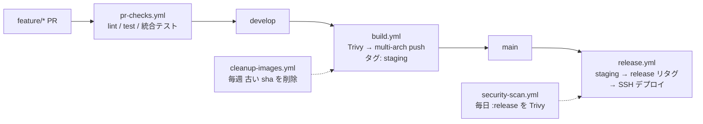

# 鍵山製パン社内 Web アプリケーション

> **Docker × Django REST × React SPA で構築する社内ツール基盤。**
> LiteLLM Proxy + Langfuse で LLMOps を一元化し、ChatGPT 風の **チャット履歴付き音声会話**、テキスト読み上げ、メディア変換、PDF 編集、OneDrive / Outlook 連携、HackerNews 監視エージェントなどを統合。

[](https://www.python.org/)
[](https://www.djangoproject.com/)
[](https://react.dev/)
[](https://www.typescriptlang.org/)
[](https://vitejs.dev/)
[](https://tailwindcss.com/)
[](https://www.postgresql.org/)
[](https://pnpm.io/)

[](https://www.docker.com/)
[](https://docs.docker.com/compose/)
[](https://github.com/features/actions)

## 概要

Docker コンテナベースの Web アプリケーションです。React SPA フロントエンドと Django REST API バックエンドで構成されています。
LLM 呼び出しは LiteLLM Proxy 経由でプロバイダー非依存、観測とプロンプト管理は Langfuse に集約しています。

本番運用は 2 系統で分担しています（詳細: [docs/deployment.md](docs/deployment.md)）。

- **ホスト構築・Traefik・本番 compose / .env の配置** — [internal.kagiyama.net](https://github.com/kagiyama-baking/internal.kagiyama.net)（Ansible）
- **イメージのビルド・スキャンと本番コンテナの入れ替え** — GitHub Actions（`build.yml` / `release.yml`）

## サービス

- 🌐 **Frontend**: React SPA（テキスト読み上げ・チャット履歴・メディア変換・**PDF 編集**の操作画面、モバイル対応 2 ペイン UI）
- 🐍 **Django API**: REST API で複数の機能を提供するバックエンドサーバ
    - 🔐 **User**: ユーザー認証・管理機能
    - **integrations/** - 外部サービス連携
        - 🤖 **LLM**: LiteLLM Proxy 経由の LLM クライアント（プロバイダー非依存・Langfuse 自動トレース）
        - 🔭 **Langfuse**: プロンプト管理モデル `LangfusePromptRef`（HN Agent / Talk が参照）+ Sessions 機能でチャット会話を集約観測
        - 🔗 **MS Graph**: Microsoft Graph API 設定・認証・クライアント
        - ☁️ **OneDrive**: Microsoft OneDrive との統合機能
        - 📅 **Outlook**: Outlook Calendar 予定取得機能
        - 🔊 **TTS**: テキスト読み上げ（Style-BERT-VITS2 プロキシ）
        - 🌤️ **Weather**: 気象庁天気予報 API
        - 📰 **HN**: Hacker News Algolia API クライアント
        - 🔍 **Tavily**: Tavily Web 検索 API クライアント
        - 💬 **Slack**: Slack Incoming Webhook 通知クライアント
    - **features/** - ビジネス機能
        - 🎙️ **Talk**: 会話生成 API + **チャット履歴セッション**（DB + ファイル永続化、編集再送、音声配信/個別 & 一括削除、LLM タイトル要約、Langfuse Session 連携）
        - 📁 **Media**: メディア変換（画像フォーマット変換、ZIP → PDF）
        - 🕵️ **HackerNews Agent**: HN 監視・分析エージェント（Watcher → Orchestrator → Detective / Devil's Advocate / Security Responder → Slack 通知。LangGraph ReAct Agent がスレッド性質に応じて 3 ツールを使い分け）
- 🎤 **Style-BERT-VITS2 API**: 日本語音声合成サービス（CPU 推論・NVIDIA GPU はオプション）

## LLM / LiteLLM / Langfuse

LLM 周辺は「接続（どのモデル・どの鍵）」「プロンプト（どのテキスト）」「機能設定（いつ・どう呼ぶ）」の 3 レイヤに分離し、いずれも Django admin と Langfuse UI から**コード変更なしで**差し替えられます。

| レイヤ | 責務 | 管理場所 |
|---|---|---|
| **LLM 接続** | どのモデルに、どの鍵で繋ぐか | Django admin「LLM設定」「LLMサービス設定」 |
| **プロンプト管理** | どのテキストを渡すか | Django admin「Langfuseプロンプト参照」+ Langfuse UI |
| **機能設定** | いつ・どのプロンプトで呼ぶか | Django admin「HackerNews Agent設定」「会話生成設定」 |

構成要素・admin と外部サービスの対応図・プロンプト命名規約は
[django_api/integrations/llm/README.md](django_api/integrations/llm/README.md) を参照してください。

## サービス構成

`docker-compose.yml` のサービス一覧（ポートはホスト公開のもの）。

| サービス | ポート | 説明 |
|---|---|---|
| `django-api` | 8000 | Django REST API（開発用 runserver 起動） |
| `celery-worker` | — | Celery ワーカー（django-api と同一イメージ） |
| `celery-beat` | — | Celery Beat スケジューラ（DatabaseScheduler） |
| `redis` | （内部のみ） | Celery ブローカー |
| `app-database` | （内部のみ） | PostgreSQL 17。**ホストへポート非公開** |
| `sbv2-api` | 5000 | Style-BERT-VITS2 音声合成（CPU 推論 / GPU 切替は [sbv2_api/README.md](sbv2_api/README.md)） |
| `frontend` | 3000 | React SPA（nginx 配信・`/api/` を django-api へプロキシ） |

```
kawashiro-server/
├── docker-compose.yml           # 開発用 Compose 設定
├── docker-compose.gpu.yml       # NVIDIA GPU ホスト用オーバーレイ（sbv2-api を CUDA 化）
├── docs/                        # 横断運用ガイド（開発・デプロイ・初期セットアップ）
├── .github/workflows/           # CI/CD（build / release / pr-checks / security-scan / cleanup-images）
├── frontend/                    # React SPA（Vite + TypeScript + Tailwind）
├── django_api/                  # Django REST API（core / user / health / integrations / features）
├── sbv2_api/                    # Style-BERT-VITS2 音声合成サーバー
└── secrets/                     # ローカル専用の鍵置き場（Git 追跡外・compose 未マウント）
```

コンテナが bind mount するホスト側の永続ディレクトリは 3 つです（作成手順はクイックスタート参照）。

| ホストパス | 用途 |
|---|---|
| `/opt/app/django-api/staticfiles` | `collectstatic` の出力 |
| `/opt/app/django-api/media` | チャット履歴の TTS 音声など（`MEDIA_ROOT`） |
| `/opt/app/sbv2-api/model_assets` | 音声合成モデル（読み取り専用マウント） |

## クイックスタート

前提: Docker Engine 20.10+ / Docker Compose v2。そのほか開発ツールは [docs/development.md](docs/development.md) を参照。

```bash
# 1. クローン
git clone https://github.com/kagiyama-baking/kawashiro-server.git
cd kawashiro-server

# 2. 環境変数（最低限 SECRET_KEY と ENCRYPTION_KEY を設定）
cp django_api/.env.sample django_api/.env
nano django_api/.env

# 3. 永続化ディレクトリ
sudo mkdir -p /opt/app/django-api/staticfiles \
              /opt/app/django-api/media \
              /opt/app/sbv2-api/model_assets
sudo chown -R $USER:$USER /opt/app/

# 4. 起動（migrate と collectstatic は自動実行）
docker compose up -d django-api frontend

# 5. 動作確認
curl http://localhost:8000/health/    # Django API → {"status": "ok"}
curl http://localhost:3000/           # Frontend
```

> **Tip:** `docker compose up -d`（全サービス）は sbv2-api のビルドで PyTorch と BERT モデルを
> ダウンロードするため、初回は数 GB・数十分かかります。音声合成を使わない間は
> `up -d django-api frontend` の軽量起動を推奨します。GPU ホストでの起動は
> [sbv2_api/README.md](sbv2_api/README.md) を参照してください。

起動後は**管理画面での初期設定**（スーパーユーザー作成 → LLM・プロンプト・機能・定期タスクの投入）が必要です。
手順は [docs/initial-setup.md](docs/initial-setup.md) にまとめています。

## 環境変数設定

`django_api/.env` に設定します（`django_api/.env.sample` が対になるサンプルです）。

| カテゴリ | 変数 | 説明 |
|---|---|---|
| Django | `SECRET_KEY` | **必須**（未設定だと起動時エラー） |
| Django | `DEBUG` | デフォルト `False` |
| Django | `ALLOWED_HOSTS` | カンマ区切り、デフォルト `localhost` |
| Django | `ENCRYPTION_KEY` | DB 内機密情報の暗号化（32 文字以上。MS Graph 秘密鍵、LiteLLM Virtual Key 等） |
| Django | `CSRF_TRUSTED_ORIGINS` | 本番時に Traefik 経由のドメインを指定（スキーム付き・カンマ区切り） |
| DB | `DB_ENGINE` / `DB_NAME` / `DB_USER` / `DB_PASSWORD` / `DB_HOST` / `DB_PORT` | PostgreSQL 接続情報。`DB_ENGINE` 未設定なら SQLite にフォールバック（`DB_ENGINE` 設定時は `DB_PASSWORD` 必須） |
| Celery | `CELERY_BROKER_URL` / `CELERY_RESULT_BACKEND` | デフォルト `redis://redis:6379/0` |
| TTS | `TTS_SERVICE_URL` | デフォルト `http://sbv2-api:5000` |
| TTS | `TTS_TIMEOUT` | TTS リクエストのタイムアウト秒（デフォルト `120`） |
| LLM | `LITELLM_PROXY_URL` | LiteLLM Proxy のベース URL（デフォルト `http://litellm-proxy:4000/v1`） |
| LLM | `LITELLM_MASTER_KEY` | `LLMProviderConfig` の Virtual Key 未設定時のフォールバック |
| Langfuse | `LANGFUSE_PUBLIC_KEY` / `LANGFUSE_SECRET_KEY` | Langfuse 認証（任意。未設定時はトレース・プロンプト取得を skip） |
| Langfuse | `LANGFUSE_BASE_URL` | self-hosted 使用時のみ（未指定時はクラウド） |
| Langfuse | `LANGFUSE_TRACING_ENVIRONMENT` | `dev` / `prd` |

> **Note:** OpenAI / Bedrock 等の**プロバイダー側 API キー**は LiteLLM Proxy 側で管理します。Django 側では LiteLLM Virtual Key のみを扱います（`LLMProviderConfig.proxy_api_key`）。
> sbv2-api の環境変数（`SBV2_*`）は [sbv2_api/README.md](sbv2_api/README.md) を参照してください。

## CI/CD

GitHub Actions による自動ビルド・テスト・リリース。詳細（各ワークフローの中身・Secrets・タグ運用・ロールバック手順）は [docs/deployment.md](docs/deployment.md) を参照してください。



- ビルド・配布対象は `django-api` と `frontend` の 2 サービス（`sbv2-api` はテスト・スキャンのみで GHCR 配布対象外）
- SBOM 生成 + SLSA Build Provenance 付与、Trivy によるイメージ・Dockerfile スキャン
- `main` への push で `release` リタグ後、Tailscale + SSH で本番コンテナを自動入れ替え

## テスト

```bash
cd django_api && uv run pytest tests/     # バックエンド（オプションは addopts で設定済み）
cd frontend && pnpm test:ci               # フロントエンド（Vitest）
```

ホストから実行する際の DB 設定（SQLite フォールバック）、CI 相当のカバレッジ付き実行、
Playwright E2E などの詳細は [docs/development.md](docs/development.md) を参照してください。

## 技術スタック

### フロントエンド

- **React 19** / **Vite** / **TypeScript**
- **Tailwind CSS v4** / **shadcn/ui**
- **Zustand**（状態管理） / **ky**（HTTP） / **pdf.js + pdf-lib**（PDF 編集）

### バックエンド

- **Django 6** + **Django REST Framework**
- **PostgreSQL 17**
- **Celery + Redis**（非同期・定期タスク）
- **uv**（高速 Python パッケージマネージャ）

### LLMOps

- **LiteLLM Proxy**（OpenAI 互換 + モデルルーティング）
- **LangChain / LangGraph**（HN Agent Orchestrator の ReAct Agent）
- **Langfuse**（トレース + プロンプト管理）

### インフラ・DevOps

- **Docker & Docker Compose**
- **nginx**（フロント配信 + API プロキシ）
- **Traefik**（リバースプロキシ / Ansible 側管理）
- **GitHub Actions** / **GitHub Container Registry**
- **Trivy**（セキュリティスキャナ）

### 外部サービス連携

- **Microsoft Graph API**（OneDrive / Outlook）
- **LiteLLM Proxy**（LLM 呼び出しの共通入口）
- **Langfuse**（観測 / プロンプト管理）
- **気象庁天気予報 API**
- **Style-BERT-VITS2**（音声合成。CPU 推論 / オプションで CUDA 12.1）
- **Hacker News Algolia API**
- **Tavily API**（Web 検索）
- **Slack Incoming Webhook**（通知）

## ドキュメントマップ

| 知りたいこと | ドキュメント |
|---|---|
| ローカル開発・テスト実行・検証環境の落とし穴 | [docs/development.md](docs/development.md) |
| CI/CD・デプロイ・Secrets・タグ運用・ロールバック | [docs/deployment.md](docs/deployment.md) |
| 初期セットアップ（管理画面の設定投入・定期タスク登録） | [docs/initial-setup.md](docs/initial-setup.md) |
| Django API の機能一覧・管理画面ガイド | [django_api/README.md](django_api/README.md) |
| LLM / LiteLLM / Langfuse の構成と命名規約 | [django_api/integrations/llm/README.md](django_api/integrations/llm/README.md) |
| 会話生成・チャットセッションの仕様 | [django_api/features/talk/README.md](django_api/features/talk/README.md) |
| メディア変換の制限値と仕様 | [django_api/features/media/README.md](django_api/features/media/README.md) |
| HN Agent のアーキテクチャとプロンプト | [django_api/features/hn_agent/README.md](django_api/features/hn_agent/README.md) |
| 気象庁天気予報クライアント | [django_api/integrations/weather/README.md](django_api/integrations/weather/README.md) |
| 音声合成 API・モデル配置・CPU/GPU 切替 | [sbv2_api/README.md](sbv2_api/README.md) |
| フロントエンドの画面構成・開発コマンド | [frontend/README.md](frontend/README.md) |
| AI エージェント向け開発規約（TDD・コマンド・レビュー規約） | [.claude/CLAUDE.md](.claude/CLAUDE.md) |
