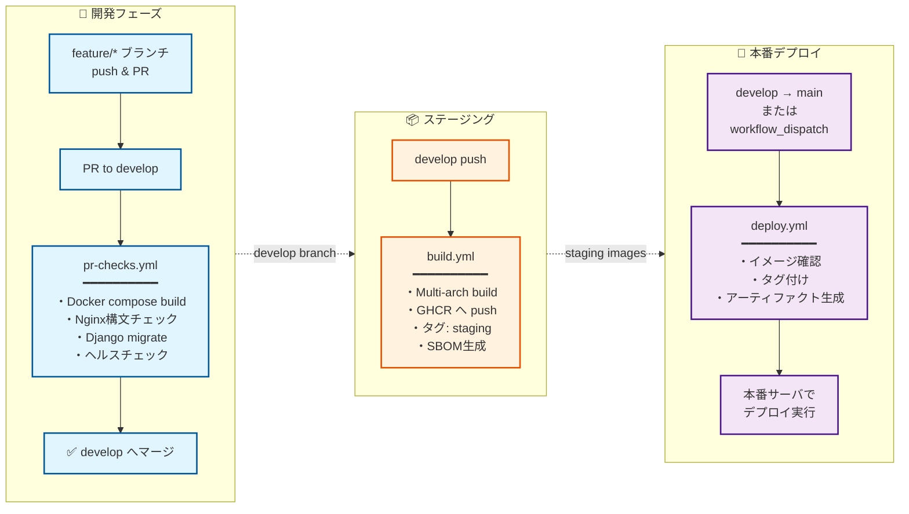

# 鍵山製パン社内 Web システム

[](https://www.docker.com/)
[](https://docs.docker.com/compose/)
[](https://nginx.org/)
[](https://github.com/features/actions)

## 概要

Docker コンテナベースの Web サービス群です。複数の Web サービスを統一されたドメインで提供し、サブドメインによるルーティングを行います。

## サービス

-   🔀 **リバースプロキシ**: Nginx ベースの高性能リバースプロキシ
-   📷 **[Immich](https://github.com/immich-app/immich)**: セルフホスト型の OSS 写真管理・共有プラットフォーム（Google Photos の代替）
-   🐍 **Django API**: REST API で複数の機能を提供するバックエンドサーバ
    -   🔐 **User**: ユーザー認証・管理機能
    -   ☁️ **OneDrive**: Microsoft OneDrive との統合機能（Microsoft Graph API）
    -   📁 **Media**: メディアファイル管理機能
    -   🔊 **TTS**: テキスト読み上げ機能（Style-BERT-VITS2 プロキシ）
    -   🛠️ **Core**: 共通機能・ユーティリティ
-   🎤 **Style-BERT-VITS2 API**: 高品質な日本語音声合成サービス
-   💾 **バックアップシステム**: Immich と Django のデータを自動バックアップ・リストア

## 特徴

-   🚀 **CI/CD**: GitHub Actions による自動ビルド・テスト・デプロイ
-   📦 **コンテナレジストリ**: GitHub Container Registry へのイメージ公開
-   🔐 **ビルド証明**: SLSA Build Provenance による信頼性の担保
-   📋 **SBOM**: ソフトウェア部品表（CycloneDX）の自動生成
-   🛡️ **脆弱性スキャン**: Trivy によるイメージ検査
-   💾 **自動バックアップ**: OneDrive への定期バックアップ機能
-   🔒 **暗号化**: 機密情報の暗号化保存（OneDrive 設定など）
-   🐍 **最新 Python 環境**: uv を使用した高速なパッケージ管理
-   ✅ **テストカバレッジ**: pytest によるテスト自動化とカバレッジ計測

## プロジェクト構成

```
kawashiro-server/
├── docker-compose.yml          # 開発用のDocker Compose設定
├── docker-compose-prod.yml     # 本番用Docker Compose設定
├── docker-compose.backup.yml   # バックアップコンテナ用のDocker Compose設定
├── README.md                   # このファイル
│
├── .github/                    # GitHub設定
│   ├── workflows/              # GitHub Actionsワークフロー
│   │   ├── build.yml           # ビルド・プッシュ（develop）
│   │   ├── deploy.yml          # デプロイ（main）
│   │   ├── pr-checks.yml       # PRチェック
│   │   ├── security-scan.yml   # セキュリティスキャン
│   │   └── cleanup-images.yml  # 古いイメージのクリーンアップ
│   └── copilot-instructions.md # Copilotレビュー設定
│
├── reverse_proxy/              # リバースプロキシ設定
│   ├── Dockerfile              # Nginxコンテナ定義
│   ├── nginx.conf              # メインのNginx設定
│   ├── conf.d/                 # サイト別設定
│   │   └── default.conf        # デフォルトサイト設定
│   └── html/                   # 静的ファイル
│       ├── index.html          # トップページ
│       └── 404.html            # カスタム404ページ
│
├── django_api/                 # Django REST API
│   ├── Dockerfile              # Django APIコンテナ
│   ├── pyproject.toml          # Python依存関係（uv使用）
│   ├── manage.py               # Djangoコマンド
│   ├── pytest.ini              # pytestの設定
│   ├── django_api/             # メインプロジェクト
│   │   ├── settings.py         # Django設定
│   │   ├── urls.py             # URLルーティング
│   │   ├── asgi.py             # ASGIエントリーポイント
│   │   └── wsgi.py             # WSGIエントリーポイント
│   ├── user/                   # ユーザー認証アプリ
│   │   ├── models.py           # ユーザーモデル
│   │   ├── serializers.py      # シリアライザー
│   │   ├── views.py            # APIビュー
│   │   └── tests.py            # テストコード
│   ├── onedrive/               # OneDrive統合アプリ（Microsoft Graph API）
│   │   ├── models.py           # 設定モデル（暗号化保存）
│   │   ├── ms_graph_client.py  # Microsoft Graph APIクライアント
│   │   ├── encryption.py       # 暗号化ユーティリティ
│   │   ├── views.py            # APIビュー
│   │   └── tests.py            # テストコード
│   ├── media/                  # メディアファイル管理アプリ
│   │   ├── models.py           # メディアモデル
│   │   ├── views.py            # APIビュー
│   │   └── tests.py            # テストコード
│   ├── core/                   # 共通コアアプリ
│   │   ├── models.py           # 共通モデル
│   │   └── views.py            # 共通ビュー
│   ├── tts/                    # TTS読み上げアプリ（sbv2-apiプロキシ）
│   │   ├── views.py            # APIビュー
│   │   ├── serializers.py      # シリアライザー（Swagger UI対応）
│   │   ├── renderers.py        # カスタムレンダラー（音声データ用）
│   │   └── urls.py             # URLルーティング
│   ├── tests/                  # 統合テストコード
│   └── htmlcov/                # カバレッジレポート
│
├── sbv2_api/                   # Style-BERT-VITS2 APIサーバー
│   ├── Dockerfile              # コンテナ定義
│   ├── server.py               # FastAPIサーバー
│   └── config.yml              # モデル設定
│
├── backup/                     # バックアップシステム
│   ├── Dockerfile              # バックアップコンテナ
│   ├── pyproject.toml          # Python依存関係（uv使用）
│   ├── README.md               # バックアップ詳細ドキュメント
│   ├── scripts/                # バックアップスクリプト（Python）
│   │   ├── backup_all.py       # 統合バックアップスクリプト
│   │   ├── backup_immich.py    # Immichバックアップ
│   │   ├── backup_django.py    # Django APIバックアップ
│   │   └── restore_immich.py   # Immichリストア
│   └── tests/                  # テストコード
│       ├── test_backup_immich.py
│       ├── test_backup_django.py
│       ├── test_restore_immich.py
│       └── test_backup_all.py
│
├── docs/                       # ドキュメント
│   └── archtecture.drawio      # アーキテクチャ図
│
└── volumes/                    # 永続化データ
    ├── reverse-proxy/
    │   └── log/nginx/          # リバースプロキシのログ
    ├── immich/
    │   ├── data/               # アップロード写真データ
    │   └── log/                # アプリケーションログ
    └── backup/                 # バックアップ出力先
```

## アーキテクチャ

### Reverse Proxy

各コンテナへ、Web アクセスは、Reverse Proxy に集約する。
Reverse Proxy は、ホスト側のポート TCP/80 でアクセスを受け付け、
サブドメインに応じて対応するコンテナ側ポートへ転送する。

```
   Browser
      │
      ▼
┌───────────────┐
│ Reverse Proxy │ :80（ホスト）
│ (Nginx)       │
└───────────────┘
      │                         ┌───────────────┐
      ├── album.example.com ─►  │ Immich        │ :2283 (コンテナ)
      │                         │ (Server)      │
      │                         └───────────────┘
      │                         ┌───────────────┐     ┌────────────────────┐
      ├── api.example.com ───►  │ Django API    │ ──► │ Style-BERT-VITS2   │ :5000 (内部)
      │                         │ (Gunicorn)    │     │ (TTS Engine)       │
      │                         └───────────────┘     └────────────────────┘
      │                         ┌───────────────┐
      └── example.com ────────► │ Reverse Proxy │ :8080 (コンテナ)
                                │ (Nginx)       │
                                └───────────────┘
```

## 必要な環境

-   Docker Engine 20.10.0+
-   Docker Compose 2.0.0+

## インストール・セットアップ

### 1. リポジトリのクローン

```bash
git clone https://github.com/kagiyama-baking/kawashiro-server.git
cd kawashiro-server
```

### 2. 環境変数の設定

```bash
# 環境変数ファイルの作成
cp .env.example .env

# .envファイルを編集して必要な値を設定
nano .env
```

### 3. サーバーの起動

```bash
# すべてのサービスを起動
docker compose up -d

# ログを確認
docker compose logs -f
```

### 4. 動作確認

```bash
# ヘルスチェック
curl http://localhost/health

# Immich（サブドメイン経由）
curl -H "Host: album.localhost" http://localhost/
```

## 環境変数設定

### 必須の環境変数

`.env`ファイルに以下の環境変数を設定してください：

```bash
# PostgreSQL設定（Immich用）
DB_USERNAME=immich          # PostgreSQLユーザー名
DB_PASSWORD=strongpassword  # PostgreSQLパスワード（必ず変更してください）
DB_DATABASE_NAME=immich      # データベース名

# Immichサーバー設定
PUBLIC_SERVER_URL=http://album.example.com  # 本番環境では実際のドメインに変更
IMMICH_LOG_LEVEL=log         # ログレベル (verbose/log/warn/error)

# タイムゾーン
TZ=Asia/Tokyo               # システムタイムゾーン
```

### Django API 設定

Django API を使用する場合は、`django_api/.env`ファイルに以下の環境変数を設定してください：

```bash
# Django設定
SECRET_KEY=YOUR_SECRET_KEY
DEBUG=False
ALLOWED_HOSTS=localhost,127.0.0.1

# データベースに保存する機密情報の暗号化に使用
# 本番環境では十分にランダムな文字列を設定してください
ENCRYPTION_KEY=YOUR_ENCRYPTION_KEY

# OneDrive統合機能（オプション）
# Microsoft Graph API を使用する場合に設定
AZURE_TENANT_ID=your-tenant-id
AZURE_CLIENT_ID=your-client-id
AZURE_CLIENT_SECRET=your-client-secret
```

### バックアップシステム設定

バックアップを使用する場合は、`.env.backup`ファイルを作成して以下の環境変数を設定してください：

```bash
# PostgreSQL設定（Immich用）
DB_HOSTNAME=immich-postgres
DB_USERNAME=immich
DB_PASSWORD=strongpassword
DB_DATABASE_NAME=immich

# Django API設定
DJANGO_API_URL=http://django-api:8000
DJANGO_API_TOKEN=your-api-token

# OneDriveバックアップ設定
ONEDRIVE_BACKUP_PATH=/Backup/kawashiro-server

# バックアップオプション
BACKUP_DATA=false                      # 写真データもバックアップするか
BACKUP_RETENTION_GENERATIONS=7         # 保持する世代数
TZ=Asia/Tokyo                          # タイムゾーン
```

## 使用方法

### サービスの管理

```bash
# 開発環境: サービスの起動
docker compose up -d

# 本番環境: サービスの起動
docker compose -f docker-compose-prod.yml up -d

# バックアップコンテナの実行
docker compose -f docker-compose.backup.yml run --rm backup python /app/scripts/backup_all.py

# サービスの停止
docker compose down

# サービスの再起動
docker compose restart

# 特定のサービスのみ再起動
docker compose restart reverse-proxy
```

### バックアップの実行

```bash
# 全てをバックアップ（ImmichとDjango API）
docker compose -f docker-compose.backup.yml run --rm backup python /app/scripts/backup_all.py

# Immichのみバックアップ
docker compose -f docker-compose.backup.yml run --rm backup python /app/scripts/backup_all.py --immich-only

# Django APIのみバックアップ
docker compose -f docker-compose.backup.yml run --rm backup python /app/scripts/backup_all.py --django-only

# Immichのリストア
docker compose -f docker-compose.backup.yml run --rm backup python /app/scripts/restore_immich.py /backup/immich_backup_20241210_120000.tar.gz
```

### ログの確認

```bash
# 全サービスのログ
docker compose logs -f

# 特定のサービスのログ
docker compose logs -f reverse-proxy
docker compose logs -f django-api
docker compose logs -f immich
docker compose logs -f immich-machine-learning
docker compose logs -f immich-redis
docker compose logs -f immich-postgres

# バックアップログ
docker compose -f docker-compose.backup.yml logs backup
```

### 設定の更新

```bash
# 設定ファイル変更後、リバースプロキシの再読み込み
docker compose exec reverse-proxy nginx -s reload

# または再起動
docker compose restart reverse-proxy
```

## CI/CD

### デプロイメントパイプライン

本プロジェクトでは、GitHub Actions を活用した 3 段階のデプロイメントパイプラインを構築しています。

### GitHub Actions ワークフロー



### ワークフロー詳細

#### 1. PR チェック (`pr-checks.yml`)

**トリガー条件:**

-   `develop`ブランチへの Pull Request 作成・更新時
-   手動実行（`workflow_dispatch`）

**実行内容:**

```yaml
# 主要なチェック項目
- Docker Composeビルド検証
- Nginx設定構文チェック
- Django APIのマイグレーションテスト
- 静的ファイル収集テスト
- ヘルスチェックエンドポイント確認
- サブドメインルーティング機能テスト
```

**タイムアウト:** 10 分

#### 2. ビルド・プッシュ (`build.yml`)

**トリガー条件:**

-   `develop`ブランチへのプッシュ時
-   手動実行（`workflow_dispatch`）

**実行内容:**

```yaml
# ビルド対象サービス
services:
  - reverse-proxy
  - django-api

# 各サービスに対して実行
- マルチアーキテクチャビルド (linux/amd64, linux/arm64)
- GitHub Container Registry (GHCR) へプッシュ
- SBOM (Software Bill of Materials) 生成
- Build Provenance (SLSA Level 3) 添付
- イメージ署名 (Cosign)
```

**生成されるタグ:**

-   `staging` - 最新のステージングビルド
-   `sha-<7文字のSHA>` - コミット固有のタグ

**タイムアウト:** 30 分

#### 3. 本番デプロイ (`deploy.yml`)

**トリガー条件:**

-   `main`ブランチへのプッシュ時
-   手動実行（任意のタグを指定可能）

**実行内容:**

```yaml
# デプロイフロー
1. verify-images: イメージの存在確認
2. tag-release: 本番タグの付与（mainブランチのみ）
3. deployment-info: デプロイ情報の生成

# 生成されるアーティファクト
- deployment-info.json    # デプロイメント詳細情報
- deployment-instructions.md  # デプロイ手順書
```

**本番タグ:**

-   `release` - 本番環境用の最新リリース
-   `latest` - 最新版（互換性のため）

### イメージのセキュリティ

#### 署名と検証

```bash
# イメージの署名を検証
cosign verify \
  --certificate-identity-regexp "https://github.com/kagiyama-baking/kawashiro-server" \
  --certificate-oidc-issuer "https://token.actions.githubusercontent.com" \
  ghcr.io/kagiyama-baking/kawashiro-server/reverse-proxy:staging

# SBOMの取得
cosign download sbom ghcr.io/kagiyama-baking/kawashiro-server/reverse-proxy:staging

# Build Provenanceの確認
gh attestation verify oci://ghcr.io/kagiyama-baking/kawashiro-server/reverse-proxy:staging \
  --owner kagiyama-baking
```

#### 脆弱性スキャン

```bash
# Trivyを使用したスキャン
trivy image ghcr.io/kagiyama-baking/kawashiro-server/reverse-proxy:staging

# Dockerスキャン
docker scout cves ghcr.io/kagiyama-baking/kawashiro-server/reverse-proxy:staging
```

### ブランチ保護ルール

#### develop ブランチ

-   PR が必須
-   ステータスチェック必須（pr-checks）
-   レビュー承認が必要
-   直接プッシュ禁止

#### main ブランチ

-   PR が必須
-   develop からのマージのみ許可
-   管理者承認が必要
-   タグ付けは自動化

### CI/CD 環境変数

GitHub Secrets に設定が必要な環境変数：

```yaml
# 必須（自動設定）
GITHUB_TOKEN: ${{ github.token }}

# オプション（カスタムレジストリ使用時）
REGISTRY_USERNAME: your-username
REGISTRY_PASSWORD: your-password
```

### デプロイメント通知

デプロイ完了時に GitHub Actions のサマリーに以下が表示されます：

```markdown
## 📦 Deployment Information

### Images

-   reverse-proxy: `ghcr.io/.../reverse-proxy:release`
-   django-api: `ghcr.io/.../django-api:release`

### Deployment Instructions

1. Pull the latest images
2. Update docker-compose-prod.yml
3. Restart services
```

### ロールバック手順

問題が発生した場合のロールバック：

```bash
# 特定のSHAタグを使用してロールバック
docker pull ghcr.io/kagiyama-baking/kawashiro-server/reverse-proxy:sha-abc1234
docker pull ghcr.io/kagiyama-baking/kawashiro-server/django-api:sha-abc1234

# docker-compose-prod.ymlを更新してタグを指定
vim docker-compose-prod.yml

# サービスを再起動
docker compose -f docker-compose-prod.yml up -d
```

### コンテナイメージのタグ戦略

| タグ           | 用途             | 更新タイミング                 |
| -------------- | ---------------- | ------------------------------ |
| `staging`      | ステージング環境 | develop ブランチへのプッシュ時 |
| `release`      | 本番環境         | main ブランチへのマージ時      |
| `latest`       | 最新版（互換性） | main ブランチへのマージ時      |
| `sha-<commit>` | 特定バージョン   | 各ビルド時                     |

## 本番環境へのデプロイ

本番環境では`docker-compose-prod.yml`を使用します。このファイルは、GitHub Container Registry にプッシュされたリリースイメージを使用します。

### 初回セットアップ

1. **必要なファイルの準備**

    ```bash
    # リポジトリのクローン
    git clone https://github.com/kagiyama-baking/kawashiro-server.git
    cd kawashiro-server

    # .envファイルの作成（Immich用の環境変数）
    cp .env.example .env
    # 必要に応じて.envファイルを編集
    ```

2. **イメージの取得と起動**

    ```bash
    # 最新のイメージをプル
    docker compose -f docker-compose-prod.yml pull

    # サービスの起動
    docker compose -f docker-compose-prod.yml up -d
    ```

### 運用コマンド

```bash
# イメージの更新と再起動
docker compose -f docker-compose-prod.yml pull
docker compose -f docker-compose-prod.yml up -d --force-recreate

# ログの確認
docker compose -f docker-compose-prod.yml logs -f

# 特定サービスのログ確認
docker compose -f docker-compose-prod.yml logs -f reverse-proxy

# サービスの停止
docker compose -f docker-compose-prod.yml down

# サービスの状態確認
docker compose -f docker-compose-prod.yml ps
```

### 本番環境で使用されるイメージ

-   `ghcr.io/kagiyama-baking/kawashiro-server/reverse-proxy:release`
-   `ghcr.io/kagiyama-baking/kawashiro-server/django-api:release`

## データのバックアップ・リストア

### Immich ボリュームデータのコピー（開発 → 本番）

開発環境から本番環境へ Immich のデータをコピーする際は、以下のコマンドを使用します。

#### 1. ホストマシン上のボリュームディレクトリから直接コピー

```bash
# Immichのデータボリューム（写真データ）をコピー
rsync -avz --progress ./volumes/immich/data/ <本番サーバーユーザー>@<本番サーバーIP>:~/Repository/kawashiro-server/volumes/immich/data/

# 例：
# rsync -avz --progress ./volumes/immich/data/ user@192.168.1.100:~/Repository/kawashiro-server/volumes/immich/data/
```

#### 2. Docker ボリュームから本番環境へコピー

名前付きボリューム（PostgreSQL、Redis、ML キャッシュ）の場合：

```bash
# PostgreSQLデータのバックアップとコピー
docker run --rm -v immich-pgdata:/source -v $(pwd)/backup:/backup alpine tar czf /backup/immich-pgdata.tar.gz -C /source .
scp ./backup/immich-pgdata.tar.gz <本番サーバーユーザー>@<本番サーバーIP>:~/backup/

# 本番サーバー側でリストア
ssh <本番サーバーユーザー>@<本番サーバーIP>
cd ~/Repository/kawashiro-server
docker compose -f docker-compose-prod.yml down
docker run --rm -v immich-pgdata:/target -v ~/backup:/backup alpine tar xzf /backup/immich-pgdata.tar.gz -C /target
docker compose -f docker-compose-prod.yml up -d

# Redisデータのバックアップとコピー
docker run --rm -v immich-redis-data:/source -v $(pwd)/backup:/backup alpine tar czf /backup/immich-redis-data.tar.gz -C /source .
scp ./backup/immich-redis-data.tar.gz <本番サーバーユーザー>@<本番サーバーIP>:~/backup/

# MLキャッシュのバックアップとコピー（オプション）
docker run --rm -v immich-ml-cache:/source -v $(pwd)/backup:/backup alpine tar czf /backup/immich-ml-cache.tar.gz -C /source .
scp ./backup/immich-ml-cache.tar.gz <本番サーバーユーザー>@<本番サーバーIP>:~/backup/
```

#### 3. 一括コピースクリプト

すべての Immich 関連データを一括でコピーする場合：

```bash
#!/bin/bash
# sync-immich-to-prod.sh

PROD_SERVER="<本番サーバーユーザー>@<本番サーバーIP>"
PROD_PATH="~/Repository/kawashiro-server"

# ホストボリュームのコピー
echo "📁 Syncing host volumes..."
rsync -avz --progress ./volumes/immich/data/ ${PROD_SERVER}:${PROD_PATH}/volumes/immich/data/

# Dockerボリュームのバックアップとコピー
echo "🗄️ Backing up Docker volumes..."
mkdir -p ./backup

# PostgreSQL
docker run --rm -v immich-pgdata:/source -v $(pwd)/backup:/backup alpine \
  tar czf /backup/immich-pgdata.tar.gz -C /source .

# Redis
docker run --rm -v immich-redis-data:/source -v $(pwd)/backup:/backup alpine \
  tar czf /backup/immich-redis-data.tar.gz -C /source .

# ML Cache
docker run --rm -v immich-ml-cache:/source -v $(pwd)/backup:/backup alpine \
  tar czf /backup/immich-ml-cache.tar.gz -C /source .

# バックアップファイルを本番サーバーへ転送
echo "📤 Transferring backups to production..."
scp ./backup/*.tar.gz ${PROD_SERVER}:~/backup/

# 本番サーバーでのリストア手順を表示
echo "✅ Backup complete! Run the following commands on production server:"
echo "cd ${PROD_PATH}"
echo "docker compose -f docker-compose-prod.yml down"
echo "docker run --rm -v immich-pgdata:/target -v ~/backup:/backup alpine tar xzf /backup/immich-pgdata.tar.gz -C /target"
echo "docker run --rm -v immich-redis-data:/target -v ~/backup:/backup alpine tar xzf /backup/immich-redis-data.tar.gz -C /target"
echo "docker run --rm -v immich-ml-cache:/target -v ~/backup:/backup alpine tar xzf /backup/immich-ml-cache.tar.gz -C /target"
echo "docker compose -f docker-compose-prod.yml up -d"
```

### 注意事項

-   コピー前に本番環境の Immich サービスを停止することを推奨します
-   データベースの整合性を保つため、PostgreSQL と Redis のデータは同時にバックアップしてください
-   大量のデータがある場合、`rsync`の`--bwlimit`オプションで帯域制限をかけることを検討してください
-   本番環境へのコピー前に必ず現在のデータをバックアップしてください

## トラブルシューティング

### よくある問題と解決方法

#### 1. コンテナが起動しない

```bash
# コンテナの状態を確認
docker compose ps

# 詳細なログを確認
docker compose logs -f [サービス名]

# 原因と対処法
# - ポート競合: 他のサービスが80番ポートを使用していないか確認
#   sudo lsof -i :80
# - メモリ不足: Docker のメモリ制限を確認
#   docker system info | grep Memory
```

#### 2. リバースプロキシが動作しない

```bash
# Nginx設定の構文チェック
docker compose exec reverse-proxy nginx -t

# 設定ファイルの再読み込み
docker compose exec reverse-proxy nginx -s reload

# DNSの確認（サブドメインが解決できるか）
nslookup test.example.com
```

#### 3. Immich にアクセスできない

```bash
# Immich関連コンテナの状態確認
docker compose ps | grep immich

# データベース接続の確認
docker compose exec immich-postgres psql -U immich -d immich -c "SELECT version();"

# Redis接続の確認
docker compose exec immich-redis redis-cli ping
```

#### 4. ディスク容量不足

```bash
# Dockerが使用している容量を確認
docker system df

# 不要なイメージ・コンテナを削除
docker system prune -a --volumes

# ログファイルのサイズを確認
du -sh ./volumes/*/log/
```

#### 5. パーミッションエラー

```bash
# ボリュームディレクトリの所有者を修正
sudo chown -R $USER:$USER ./volumes/

# 実行権限を付与（スクリプトの場合）
chmod +x ./scripts/*.sh
```

### ログの確認方法

```bash
# 全サービスのログをリアルタイム表示
docker compose logs -f

# 特定期間のログを表示（最新100行）
docker compose logs --tail=100

# エラーログのみ抽出
docker compose logs 2>&1 | grep -i error

# ログをファイルに保存
docker compose logs > logs_$(date +%Y%m%d_%H%M%S).txt
```

## セキュリティ設定

### 推奨されるセキュリティ対策

#### 1. ファイアウォール設定

```bash
# UFWを使用した例
sudo ufw allow 22/tcp    # SSH
sudo ufw allow 80/tcp    # HTTP
sudo ufw allow 443/tcp   # HTTPS（SSL使用時）
sudo ufw enable
```

#### 2. SSL/TLS 証明書の設定

Let's Encrypt を使用した無料 SSL 証明書の設定：

```bash
# Certbotのインストール
sudo apt-get update
sudo apt-get install certbot

# 証明書の取得
sudo certbot certonly --standalone -d example.com -d *.example.com

# Nginx設定に証明書を追加（reverse_proxy/conf.d/default.conf）
# server {
#     listen 443 ssl;
#     ssl_certificate /etc/letsencrypt/live/example.com/fullchain.pem;
#     ssl_certificate_key /etc/letsencrypt/live/example.com/privkey.pem;
# }
```

#### 3. 環境変数のセキュリティ

```bash
# .envファイルの権限を制限
chmod 600 .env

# Gitに.envファイルが含まれていないことを確認
git status --ignored
```

#### 4. Docker セキュリティ

```bash
# Dockerデーモンのセキュリティオプション
# /etc/docker/daemon.json
{
  "live-restore": true,
  "userland-proxy": false,
  "log-driver": "json-file",
  "log-opts": {
    "max-size": "10m",
    "max-file": "3"
  }
}
```

#### 5. 定期的なアップデート

```bash
# システムパッケージのアップデート
sudo apt-get update && sudo apt-get upgrade

# Dockerイメージの更新
docker compose pull
docker compose up -d

# 脆弱性スキャン
docker scan reverse-proxy
```

## 開発者向けガイド

### 開発環境のセットアップ

```bash
# 開発用ブランチの作成
git checkout -b feature/your-feature-name

# 開発用のdocker-compose.override.ymlを作成
cat << EOF > docker-compose.override.yml
services:
  reverse-proxy:
    build:
      context: ./reverse_proxy
    volumes:
      - ./reverse_proxy/nginx.conf:/etc/nginx/nginx.conf:ro
      - ./reverse_proxy/conf.d:/etc/nginx/conf.d:ro
EOF
```

### テストの実行

```bash
# 構文チェック
docker compose exec reverse-proxy nginx -t

# ヘルスチェック
./scripts/health-check.sh

# 負荷テスト（Apache Benchを使用）
ab -n 1000 -c 10 http://localhost/
```

### 新しいサービスの追加

1. `docker-compose.yml`にサービス定義を追加
2. リバースプロキシ設定を更新（`reverse_proxy/conf.d/`）
3. 必要に応じて環境変数を追加（`.env.example`）
4. ドキュメントを更新（README.md）

### デバッグ

```bash
# コンテナ内でシェルを実行
docker compose exec [サービス名] /bin/sh

# ネットワークの確認
docker network inspect kawashiro-server_default

# プロセスの確認
docker compose exec [サービス名] ps aux
```

## 貢献ガイドライン

### プルリクエストの作成

1. **Issue の作成**: バグ報告や機能提案は、まず Issue を作成してください
2. **ブランチの命名規則**:
    - 機能追加: `feature/機能名`
    - バグ修正: `bugfix/バグ名`
    - ドキュメント: `docs/内容`
3. **コミットメッセージ**: 日本語で簡潔に変更内容を記載
4. **テスト**: PR 作成前に必ずローカルでテストを実行

### コーディング規約

-   Dockerfile はベストプラクティスに従う
-   Nginx 設定はインデントを統一（スペース 4 つ）
-   環境変数は大文字とアンダースコア
-   ドキュメントは日本語で記述

## ライセンス

このプロジェクトは MIT ライセンスの下で公開されています。詳細は[LICENSE](LICENSE)ファイルを参照してください。

## サポート

-   **Issue**: [GitHub Issues](https://github.com/kagiyama-baking/kawashiro-server/issues)
-   **Discussion**: [GitHub Discussions](https://github.com/kagiyama-baking/kawashiro-server/discussions)
-   **Wiki**: [プロジェクト Wiki](https://github.com/kagiyama-baking/kawashiro-server/wiki)

## 技術スタック

### バックエンド

-   **Django**: Python Web フレームワーク
-   **Django REST Framework**: REST API 構築
-   **Gunicorn**: WSGI HTTP サーバー（本番環境）
-   **PostgreSQL**: リレーショナルデータベース（Immich 用）
-   **SQLite**: 軽量データベース（Django API 用）

### インフラ・DevOps

-   **Docker & Docker Compose**: コンテナ化とオーケストレーション
-   **Nginx**: リバースプロキシ・Web サーバー
-   **GitHub Actions**: CI/CD パイプライン
-   **GitHub Container Registry**: コンテナイメージレジストリ

### ツール・ユーティリティ

-   **uv**: 高速 Python パッケージマネージャー
-   **pytest**: Python テストフレームワーク
-   **Ruff**: Python リンター・フォーマッター
-   **Trivy**: コンテナセキュリティスキャナー

### 外部サービス連携

-   **Microsoft Graph API**: OneDrive 連携
-   **Valkey (Redis)**: キャッシュ・セッション管理
-   **Style-BERT-VITS2**: 高品質日本語音声合成エンジン

## 謝辞

このプロジェクトは以下のオープンソースプロジェクトを使用しています：

-   [Immich](https://github.com/immich-app/immich) - セルフホスト型写真管理プラットフォーム
-   [Django](https://www.djangoproject.com/) - Python Web フレームワーク
-   [Nginx](https://nginx.org/) - 高性能 Web サーバー
-   [Docker](https://www.docker.com/) - コンテナ化プラットフォーム
-   [PostgreSQL](https://www.postgresql.org/) - オープンソースデータベース
-   [Valkey](https://valkey.io/) - Redis 互換インメモリデータストア
-   [uv](https://github.com/astral-sh/uv) - 高速 Python パッケージマネージャー
-   [Style-BERT-VITS2](https://github.com/litagin02/Style-Bert-VITS2) - 高品質日本語音声合成エンジン
