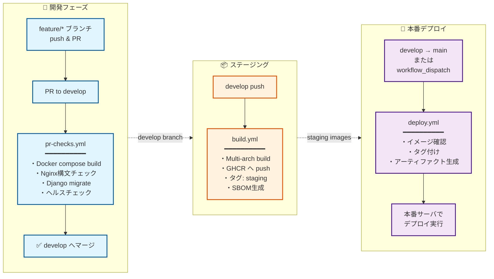

# 鍵山製パン社内 Web システム

[](https://www.docker.com/)
[](https://docs.docker.com/compose/)
[](https://nginx.org/)
[](https://github.com/features/actions)
[](https://prometheus.io/)
[](https://grafana.com/)

## 概要

Docker コンテナベースの Web サービス群です。複数の Web サービスを統一されたドメインで提供し、サブドメインによるルーティングを行います。

## サービス

-   🔀 **リバースプロキシ**: Nginx ベースの高性能リバースプロキシ
-   🐍 **Django API**: REST API で複数の機能を提供するバックエンドサーバ
    -   🔐 **User**: ユーザー認証・管理機能
    -   ☁️ **OneDrive**: Microsoft OneDrive との統合機能（ファイルアップロード・管理）
    -   📅 **Outlook**: Outlook Calendar 予定取得機能
    -   📁 **Media**: メディアファイル管理機能
    -   🔊 **TTS**: テキスト読み上げ機能（Style-BERT-VITS2 プロキシ）
    -   🌤️ **Weather**: 気象庁天気予報 API（今日・明日・明後日の天気、気温、降水確率）
    -   🎙️ **Greeting**: 挨拶 API（設定ベースの柔軟な挨拶生成、天気・予定・日時情報を選択可能、TTS 音声合成対応）
    -   🤖 **LLM Client**: OpenAI API クライアント（テキスト生成）
    -   🔧 **LLM Config**: LLM 設定管理
    -   🔗 **MS Graph Config**: Microsoft Graph API 共通設定・認証モジュール
    -   🔗 **MS Graph Client**: OneDrive/Outlook 統一クライアント
    -   🛠️ **Core**: 共通機能・ユーティリティ
-   🎤 **Style-BERT-VITS2 API**: 高品質な日本語音声合成サービス
-   💾 **バックアップシステム**: Django のデータを自動バックアップ・リストア
-   📊 **監視・オブザーバビリティ**: Prometheus + Grafana + Loki + Tempo による統合監視基盤
    -   📈 **Prometheus**: メトリクス収集（cAdvisor, Node Exporter, Nginx Exporter 連携）
    -   📊 **Grafana**: 監視ダッシュボード（Django APM, Docker Containers, Nginx, Node Exporter）
    -   📝 **Loki + Promtail**: ログ集約（Nginx ログ + Docker コンテナログ）
    -   🔍 **Tempo**: 分散トレーシング（OpenTelemetry SDK による自動・手動計装）

## 特徴

-   🚀 **CI/CD**: GitHub Actions による自動ビルド・テスト・デプロイ
-   📦 **コンテナレジストリ**: GitHub Container Registry へのイメージ公開
-   🔐 **ビルド証明**: SLSA Build Provenance による信頼性の担保
-   📋 **SBOM**: ソフトウェア部品表（CycloneDX）の自動生成
-   🛡️ **脆弱性スキャン**: Trivy によるイメージ検査
-   💾 **自動バックアップ**: OneDrive への定期バックアップ機能
-   🔒 **暗号化**: 機密情報の暗号化保存（OneDrive 設定など）
-   🐍 **最新 Python 環境**: uv を使用した高速なパッケージ管理
-   ✅ **テストカバレッジ**: pytest によるテスト自動化とカバレッジ計測
-   📊 **オブザーバビリティ**: メトリクス・ログ・トレースの三本柱による統合監視

## プロジェクト構成

```
kawashiro-server/
├── docker-compose.yml          # 開発用のDocker Compose設定
├── docker-compose-prod.yml     # 本番用Docker Compose設定
├── docker-compose.backup.yml   # バックアップコンテナ用のDocker Compose設定
├── README.md                   # このファイル
│
├── .github/                    # GitHub設定
│   ├── workflows/              # GitHub Actionsワークフロー
│   │   ├── build.yml           # ビルド・プッシュ（develop）
│   │   ├── deploy.yml          # デプロイ（main）
│   │   ├── pr-checks.yml       # PRチェック
│   │   ├── security-scan.yml   # セキュリティスキャン
│   │   └── cleanup-images.yml  # 古いイメージのクリーンアップ
│   └── copilot-instructions.md # Copilotレビュー設定
│
├── reverse_proxy/              # リバースプロキシ設定
│   ├── Dockerfile              # Nginxコンテナ定義
│   ├── nginx.conf              # メインのNginx設定
│   ├── conf.d/                 # サイト別設定
│   │   └── default.conf        # デフォルトサイト設定
│   └── html/                   # 静的ファイル
│       ├── index.html          # トップページ
│       └── 404.html            # カスタム404ページ
│
├── django_api/                 # Django REST API
│   ├── Dockerfile              # Django APIコンテナ
│   ├── pyproject.toml          # Python依存関係（uv使用）
│   ├── manage.py               # Djangoコマンド
│   ├── pytest.ini              # pytestの設定
│   ├── django_api/             # メインプロジェクト
│   │   ├── settings.py         # Django設定
│   │   ├── urls.py             # URLルーティング
│   │   ├── asgi.py             # ASGIエントリーポイント
│   │   └── wsgi.py             # WSGIエントリーポイント
│   ├── user/                   # ユーザー認証アプリ
│   ├── onedrive/               # OneDrive統合アプリ
│   ├── outlook/                # Outlook Calendar予定取得アプリ
│   ├── media/                  # メディアファイル管理アプリ
│   ├── core/                   # 共通コアアプリ（暗号化ユーティリティ等）
│   ├── tts/                    # TTS読み上げアプリ（sbv2-apiプロキシ）
│   ├── weather/                # 気象庁天気予報アプリ
│   ├── greeting/               # 挨拶アプリ（設定ベースのAI挨拶生成・TTS対応）
│   ├── llm_client/             # OpenAI APIクライアント
│   ├── llm_config/             # LLM設定管理
│   ├── msgraph_client/         # Microsoft Graph統一クライアント
│   ├── msgraph_config/         # Microsoft Graph設定・認証管理
│   ├── tests/                  # 統合テストコード
│   └── htmlcov/                # カバレッジレポート
│
├── sbv2_api/                   # Style-BERT-VITS2 APIサーバー
│   ├── Dockerfile              # コンテナ定義
│   ├── server.py               # FastAPIサーバー
│   └── config.yml              # モデル設定
│
├── backup/                     # バックアップシステム
│   ├── Dockerfile              # バックアップコンテナ
│   ├── pyproject.toml          # Python依存関係（uv使用）
│   ├── README.md               # バックアップ詳細ドキュメント
│   ├── scripts/                # バックアップスクリプト（Python）
│   │   ├── backup_all.py       # 統合バックアップスクリプト
│   │   └── backup_django.py    # Django APIバックアップ
│   └── tests/                  # テストコード
│
├── prometheus/                  # Prometheus設定
│   └── prometheus.yml          # スクレイプターゲット・保持期間設定
│
├── grafana/                    # Grafana設定
│   └── provisioning/           # 自動プロビジョニング
│       ├── datasources/        # データソース（Prometheus/Loki/Tempo）
│       └── dashboards/         # ダッシュボード定義
│           └── json/           # Django APM/Docker/Nginx/Node Exporter
│
├── loki/                       # Lokiログ集約設定
│   └── loki.yml                # ストレージ・保持期間設定
│
├── promtail/                   # Promtailログ収集設定
│   └── promtail.yml            # ログソース・ラベル設定
│
├── tempo/                      # Tempo分散トレーシング設定
│   └── tempo.yml               # OTLP受信・ストレージ設定
│
├── docs/                       # ドキュメント
│   └── archtecture.drawio      # アーキテクチャ図
│
└── volumes/                    # 永続化データ
    ├── reverse-proxy/
    │   └── log/nginx/          # リバースプロキシのログ
    └── backup/                 # バックアップ出力先
```

## アーキテクチャ

### Reverse Proxy

各コンテナへ、Web アクセスは、Reverse Proxy に集約する。
Reverse Proxy は、ホスト側のポート TCP/80 でアクセスを受け付け、
サブドメインに応じて対応するコンテナ側ポートへ転送する。

```
   Browser
      │
      ▼
┌───────────────┐
│ Reverse Proxy │ :80（ホスト）
│ (Nginx)       │
└───────────────┘
      │                         ┌───────────────┐     ┌────────────────────┐
      ├── api.example.com ───►  │ Django API    │ ──► │ Style-BERT-VITS2   │ :5000 (内部)
      │                         │ (Gunicorn)    │     │ (TTS Engine)       │
      │                         └───────────────┘     └────────────────────┘
      │                         ┌───────────────┐
      └── example.com ────────► │ Reverse Proxy │ :8080 (コンテナ)
                                │ (Nginx)       │
                                └───────────────┘
```

### 監視・オブザーバビリティ

```
┌──────────────┐   メトリクス   ┌────────────────┐
│  Prometheus  │◄──────────────│  Node Exporter │  ホストメトリクス
│  :9090       │               └────────────────┘
│              │◄──────────────┌────────────────┐
│              │               │  cAdvisor      │  コンテナメトリクス
│              │               └────────────────┘
│              │◄──────────────┌────────────────┐
│              │               │  Nginx Exporter│  Nginxメトリクス
│              │               └────────────────┘
│              │◄──────────────┌────────────────┐
│              │               │  Django API    │  /metrics エンドポイント
└──────┬───────┘               └───────┬────────┘
       │                               │ OTel gRPC
       ▼                               ▼
┌──────────────┐               ┌────────────────┐
│   Grafana    │◄──────────────│    Tempo       │  分散トレーシング
│   :3000      │               │    :4317       │
│              │               └────────────────┘
│              │◄──────────────┌────────────────┐
│              │               │     Loki       │  ログ集約
│              │               │    :3100       │
└──────────────┘               └───────┬────────┘
                                       ▲
                               ┌───────┴────────┐
                               │   Promtail     │  Nginx + Docker ログ収集
                               └────────────────┘
```

## 必要な環境

-   Docker Engine 20.10.0+
-   Docker Compose 2.0.0+

## インストール・セットアップ

### 1. リポジトリのクローン

```bash
git clone https://github.com/kagiyama-baking/kawashiro-server.git
cd kawashiro-server
```

### 2. 環境変数の設定

```bash
# 環境変数ファイルの作成
cp .env.example .env

# .envファイルを編集して必要な値を設定
nano .env
```

### 3. サーバーの起動

```bash
# すべてのサービスを起動
docker compose up -d

# ログを確認
docker compose logs -f
```

### 4. 動作確認

```bash
# ヘルスチェック
curl http://localhost/health
```

## 環境変数設定

### 必須の環境変数

`.env`ファイルに以下の環境変数を設定してください：

```bash
# タイムゾーン
TZ=Asia/Tokyo               # システムタイムゾーン
```

### Grafana 設定

`.env`ファイルに以下の環境変数を追加してください：

```bash
# Grafana管理者設定
GF_SECURITY_ADMIN_USER=admin           # 管理者ユーザー名
GF_SECURITY_ADMIN_PASSWORD=changeme    # 管理者パスワード（必ず変更してください）
```

### Django API 設定

Django API を使用する場合は、`django_api/.env`ファイルに以下の環境変数を設定してください：

```bash
# Django設定
SECRET_KEY=YOUR_SECRET_KEY
DEBUG=False
ALLOWED_HOSTS=localhost,127.0.0.1

# データベースに保存する機密情報の暗号化に使用
# 本番環境では十分にランダムな文字列を設定してください
ENCRYPTION_KEY=YOUR_ENCRYPTION_KEY

# Microsoft Graph API（OneDrive/Outlook統合機能）
AZURE_TENANT_ID=your-tenant-id
AZURE_CLIENT_ID=your-client-id
AZURE_CLIENT_SECRET=your-client-secret

# OpenAI API（挨拶機能などのAI生成に使用）
OPENAI_API_KEY=your-openai-api-key

# Style-BERT-VITS2 API（音声合成機能）
TTS_API_URL=http://sbv2-api:5000
```

### バックアップシステム設定

バックアップを使用する場合は、`.env.backup`ファイルを作成して以下の環境変数を設定してください：

```bash
# Django API設定
DJANGO_API_URL=http://django-api:8000
DJANGO_API_TOKEN=your-api-token

# OneDriveバックアップ設定
ONEDRIVE_BACKUP_PATH=/Backup/kawashiro-server

# バックアップオプション
BACKUP_DATA=false                      # 写真データもバックアップするか
BACKUP_RETENTION_GENERATIONS=7         # 保持する世代数
TZ=Asia/Tokyo                          # タイムゾーン
```

## 使用方法

### サービスの管理

```bash
# 開発環境: サービスの起動
docker compose up -d

# 本番環境: サービスの起動
docker compose -f docker-compose-prod.yml up -d

# バックアップコンテナの実行
docker compose -f docker-compose.backup.yml run --rm backup python /app/scripts/backup_all.py

# サービスの停止
docker compose down

# サービスの再起動
docker compose restart

# 特定のサービスのみ再起動
docker compose restart reverse-proxy
```

### バックアップの実行

```bash
# Django APIをバックアップ
docker compose -f docker-compose.backup.yml run --rm backup python /app/scripts/backup_all.py
```

### ログの確認

```bash
# 全サービスのログ
docker compose logs -f

# 特定のサービスのログ
docker compose logs -f reverse-proxy
docker compose logs -f django-api

# バックアップログ
docker compose -f docker-compose.backup.yml logs backup

# 監視系サービスのログ
docker compose logs -f prometheus
docker compose logs -f grafana
docker compose logs -f loki
docker compose logs -f tempo
docker compose logs -f promtail
```

### 監視ダッシュボードへのアクセス

```bash
# Grafana（開発環境）
# http://localhost:3001 でアクセス（初期認証情報は.envで設定）

# Prometheus（開発環境）
# http://localhost:9090 でアクセス

# Grafana > Explore > Tempo でトレース検索
# service.name="django-api" でフィルタリング
```

### 設定の更新

```bash
# 設定ファイル変更後、リバースプロキシの再読み込み
docker compose exec reverse-proxy nginx -s reload

# または再起動
docker compose restart reverse-proxy
```

## CI/CD

### デプロイメントパイプライン

本プロジェクトでは、GitHub Actions を活用した 3 段階のデプロイメントパイプラインを構築しています。

### GitHub Actions ワークフロー



### ワークフロー詳細

#### 1. PR チェック (`pr-checks.yml`)

**トリガー条件:**

-   `develop`ブランチへの Pull Request 作成・更新時
-   手動実行（`workflow_dispatch`）

**実行内容:**

```yaml
# 主要なチェック項目
- Docker Composeビルド検証
- Nginx設定構文チェック
- Django APIのマイグレーションテスト
- 静的ファイル収集テスト
- ヘルスチェックエンドポイント確認
- サブドメインルーティング機能テスト
```

**タイムアウト:** 10 分

#### 2. ビルド・プッシュ (`build.yml`)

**トリガー条件:**

-   `develop`ブランチへのプッシュ時
-   手動実行（`workflow_dispatch`）

**実行内容:**

```yaml
# ビルド対象サービス
services:
  - reverse-proxy
  - django-api

# 各サービスに対して実行
- マルチアーキテクチャビルド (linux/amd64, linux/arm64)
- GitHub Container Registry (GHCR) へプッシュ
- SBOM (Software Bill of Materials) 生成
- Build Provenance (SLSA Level 3) 添付
- イメージ署名 (Cosign)
```

**生成されるタグ:**

-   `staging` - 最新のステージングビルド
-   `sha-<7文字のSHA>` - コミット固有のタグ

**タイムアウト:** 30 分

#### 3. 本番デプロイ (`deploy.yml`)

**トリガー条件:**

-   `main`ブランチへのプッシュ時
-   手動実行（任意のタグを指定可能）

**実行内容:**

```yaml
# デプロイフロー
1. verify-images: イメージの存在確認
2. tag-release: 本番タグの付与（mainブランチのみ）
3. deployment-info: デプロイ情報の生成

# 生成されるアーティファクト
- deployment-info.json    # デプロイメント詳細情報
- deployment-instructions.md  # デプロイ手順書
```

**本番タグ:**

-   `release` - 本番環境用の最新リリース
-   `latest` - 最新版（互換性のため）

### イメージのセキュリティ

#### 署名と検証

```bash
# イメージの署名を検証
cosign verify \
  --certificate-identity-regexp "https://github.com/kagiyama-baking/kawashiro-server" \
  --certificate-oidc-issuer "https://token.actions.githubusercontent.com" \
  ghcr.io/kagiyama-baking/kawashiro-server/reverse-proxy:staging

# SBOMの取得
cosign download sbom ghcr.io/kagiyama-baking/kawashiro-server/reverse-proxy:staging

# Build Provenanceの確認
gh attestation verify oci://ghcr.io/kagiyama-baking/kawashiro-server/reverse-proxy:staging \
  --owner kagiyama-baking
```

#### 脆弱性スキャン

```bash
# Trivyを使用したスキャン
trivy image ghcr.io/kagiyama-baking/kawashiro-server/reverse-proxy:staging

# Dockerスキャン
docker scout cves ghcr.io/kagiyama-baking/kawashiro-server/reverse-proxy:staging
```

### ブランチ保護ルール

#### develop ブランチ

-   PR が必須
-   ステータスチェック必須（pr-checks）
-   レビュー承認が必要
-   直接プッシュ禁止

#### main ブランチ

-   PR が必須
-   develop からのマージのみ許可
-   管理者承認が必要
-   タグ付けは自動化

### CI/CD 環境変数

GitHub Secrets に設定が必要な環境変数：

```yaml
# 必須（自動設定）
GITHUB_TOKEN: ${{ github.token }}

# オプション（カスタムレジストリ使用時）
REGISTRY_USERNAME: your-username
REGISTRY_PASSWORD: your-password
```

### デプロイメント通知

デプロイ完了時に GitHub Actions のサマリーに以下が表示されます：

```markdown
## 📦 Deployment Information

### Images

-   reverse-proxy: `ghcr.io/.../reverse-proxy:release`
-   django-api: `ghcr.io/.../django-api:release`

### Deployment Instructions

1. Pull the latest images
2. Update docker-compose-prod.yml
3. Restart services
```

### ロールバック手順

問題が発生した場合のロールバック：

```bash
# 特定のSHAタグを使用してロールバック
docker pull ghcr.io/kagiyama-baking/kawashiro-server/reverse-proxy:sha-abc1234
docker pull ghcr.io/kagiyama-baking/kawashiro-server/django-api:sha-abc1234

# docker-compose-prod.ymlを更新してタグを指定
vim docker-compose-prod.yml

# サービスを再起動
docker compose -f docker-compose-prod.yml up -d
```

### コンテナイメージのタグ戦略

| タグ           | 用途             | 更新タイミング                 |
| -------------- | ---------------- | ------------------------------ |
| `staging`      | ステージング環境 | develop ブランチへのプッシュ時 |
| `release`      | 本番環境         | main ブランチへのマージ時      |
| `latest`       | 最新版（互換性） | main ブランチへのマージ時      |
| `sha-<commit>` | 特定バージョン   | 各ビルド時                     |

## 本番環境へのデプロイ

本番環境では`docker-compose-prod.yml`を使用します。このファイルは、GitHub Container Registry にプッシュされたリリースイメージを使用します。

### 初回セットアップ

1. **必要なファイルの準備**

    ```bash
    # リポジトリのクローン
    git clone https://github.com/kagiyama-baking/kawashiro-server.git
    cd kawashiro-server

    # .envファイルの作成
    cp .env.example .env
    # 必要に応じて.envファイルを編集
    ```

2. **イメージの取得と起動**

    ```bash
    # 最新のイメージをプル
    docker compose -f docker-compose-prod.yml pull

    # サービスの起動
    docker compose -f docker-compose-prod.yml up -d
    ```

### 運用コマンド

```bash
# イメージの更新と再起動
docker compose -f docker-compose-prod.yml pull
docker compose -f docker-compose-prod.yml up -d --force-recreate

# ログの確認
docker compose -f docker-compose-prod.yml logs -f

# 特定サービスのログ確認
docker compose -f docker-compose-prod.yml logs -f reverse-proxy

# サービスの停止
docker compose -f docker-compose-prod.yml down

# サービスの状態確認
docker compose -f docker-compose-prod.yml ps
```

### 本番環境で使用されるイメージ

-   `ghcr.io/kagiyama-baking/kawashiro-server/reverse-proxy:release`
-   `ghcr.io/kagiyama-baking/kawashiro-server/django-api:release`

## トラブルシューティング

### よくある問題と解決方法

#### 1. コンテナが起動しない

```bash
# コンテナの状態を確認
docker compose ps

# 詳細なログを確認
docker compose logs -f [サービス名]

# 原因と対処法
# - ポート競合: 他のサービスが80番ポートを使用していないか確認
#   sudo lsof -i :80
# - メモリ不足: Docker のメモリ制限を確認
#   docker system info | grep Memory
```

#### 2. リバースプロキシが動作しない

```bash
# Nginx設定の構文チェック
docker compose exec reverse-proxy nginx -t

# 設定ファイルの再読み込み
docker compose exec reverse-proxy nginx -s reload

# DNSの確認（サブドメインが解決できるか）
nslookup test.example.com
```

#### 3. ディスク容量不足

```bash
# Dockerが使用している容量を確認
docker system df

# 不要なイメージ・コンテナを削除
docker system prune -a --volumes

# ログファイルのサイズを確認
du -sh ./volumes/*/log/
```

#### 4. パーミッションエラー

```bash
# ボリュームディレクトリの所有者を修正
sudo chown -R $USER:$USER ./volumes/

# 実行権限を付与（スクリプトの場合）
chmod +x ./scripts/*.sh
```

### ログの確認方法

```bash
# 全サービスのログをリアルタイム表示
docker compose logs -f

# 特定期間のログを表示（最新100行）
docker compose logs --tail=100

# エラーログのみ抽出
docker compose logs 2>&1 | grep -i error

# ログをファイルに保存
docker compose logs > logs_$(date +%Y%m%d_%H%M%S).txt
```

## セキュリティ設定

### 推奨されるセキュリティ対策

#### 1. ファイアウォール設定

```bash
# UFWを使用した例
sudo ufw allow 22/tcp    # SSH
sudo ufw allow 80/tcp    # HTTP
sudo ufw allow 443/tcp   # HTTPS（SSL使用時）
sudo ufw enable
```

#### 2. SSL/TLS 証明書の設定

Let's Encrypt を使用した無料 SSL 証明書の設定：

```bash
# Certbotのインストール
sudo apt-get update
sudo apt-get install certbot

# 証明書の取得
sudo certbot certonly --standalone -d example.com -d *.example.com

# Nginx設定に証明書を追加（reverse_proxy/conf.d/default.conf）
# server {
#     listen 443 ssl;
#     ssl_certificate /etc/letsencrypt/live/example.com/fullchain.pem;
#     ssl_certificate_key /etc/letsencrypt/live/example.com/privkey.pem;
# }
```

#### 3. 環境変数のセキュリティ

```bash
# .envファイルの権限を制限
chmod 600 .env

# Gitに.envファイルが含まれていないことを確認
git status --ignored
```

#### 4. Docker セキュリティ

```bash
# Dockerデーモンのセキュリティオプション
# /etc/docker/daemon.json
{
  "live-restore": true,
  "userland-proxy": false,
  "log-driver": "json-file",
  "log-opts": {
    "max-size": "10m",
    "max-file": "3"
  }
}
```

#### 5. 定期的なアップデート

```bash
# システムパッケージのアップデート
sudo apt-get update && sudo apt-get upgrade

# Dockerイメージの更新
docker compose pull
docker compose up -d

# 脆弱性スキャン
docker scan reverse-proxy
```

## 開発者向けガイド

### 開発環境のセットアップ

```bash
# 開発用ブランチの作成
git checkout -b feature/your-feature-name

# 開発用のdocker-compose.override.ymlを作成
cat << EOF > docker-compose.override.yml
services:
  reverse-proxy:
    build:
      context: ./reverse_proxy
    volumes:
      - ./reverse_proxy/nginx.conf:/etc/nginx/nginx.conf:ro
      - ./reverse_proxy/conf.d:/etc/nginx/conf.d:ro
EOF
```

### テストの実行

```bash
# 構文チェック
docker compose exec reverse-proxy nginx -t

# ヘルスチェック
./scripts/health-check.sh

# 負荷テスト（Apache Benchを使用）
ab -n 1000 -c 10 http://localhost/
```

### 新しいサービスの追加

1. `docker-compose.yml`にサービス定義を追加
2. リバースプロキシ設定を更新（`reverse_proxy/conf.d/`）
3. 必要に応じて環境変数を追加（`.env.example`）
4. ドキュメントを更新（README.md）

### デバッグ

```bash
# コンテナ内でシェルを実行
docker compose exec [サービス名] /bin/sh

# ネットワークの確認
docker network inspect kawashiro-server_default

# プロセスの確認
docker compose exec [サービス名] ps aux
```

### コーディング規約

-   Dockerfile はベストプラクティスに従う
-   Nginx 設定はインデントを統一（スペース 4 つ）
-   環境変数は大文字とアンダースコア
-   ドキュメントは日本語で記述

## 技術スタック

### バックエンド

-   **Django**: Python Web フレームワーク
-   **Django REST Framework**: REST API 構築
-   **Gunicorn**: WSGI HTTP サーバー（本番環境）
-   **SQLite**: 軽量データベース（Django API 用）

### インフラ・DevOps

-   **Docker & Docker Compose**: コンテナ化とオーケストレーション
-   **Nginx**: リバースプロキシ・Web サーバー
-   **GitHub Actions**: CI/CD パイプライン
-   **GitHub Container Registry**: コンテナイメージレジストリ

### 監視・オブザーバビリティ

-   **Prometheus**: メトリクス収集・時系列データベース
-   **Grafana**: 監視ダッシュボード・可視化
-   **Loki**: ログ集約システム
-   **Promtail**: ログ収集エージェント
-   **Grafana Tempo**: 分散トレーシングバックエンド
-   **OpenTelemetry SDK**: 分散トレーシング計装（Django, requests 自動計装）
-   **cAdvisor**: Docker コンテナメトリクス収集
-   **Node Exporter**: ホストマシンメトリクス収集
-   **Nginx Exporter**: Nginx メトリクス収集

### ツール・ユーティリティ

-   **uv**: 高速 Python パッケージマネージャー
-   **pytest**: Python テストフレームワーク
-   **Ruff**: Python リンター・フォーマッター
-   **Trivy**: コンテナセキュリティスキャナー

### 外部サービス連携

-   **Microsoft Graph API**: OneDrive/Outlook 連携
-   **OpenAI API**: テキスト生成（挨拶機能）
-   **気象庁天気予報 API**: 天気予報データ取得
-   **Valkey (Redis)**: キャッシュ・セッション管理
-   **Style-BERT-VITS2**: 高品質日本語音声合成エンジン

## 謝辞

このプロジェクトは以下のオープンソースプロジェクト・サービスを使用しています：

-   [Django](https://www.djangoproject.com/) - Python Web フレームワーク
-   [Nginx](https://nginx.org/) - 高性能 Web サーバー
-   [Docker](https://www.docker.com/) - コンテナ化プラットフォーム
-   [uv](https://github.com/astral-sh/uv) - 高速 Python パッケージマネージャー
-   [Style-BERT-VITS2](https://github.com/litagin02/Style-Bert-VITS2) - 高品質日本語音声合成エンジン
-   [OpenAI](https://openai.com/) - AI テキスト生成 API
-   [Prometheus](https://prometheus.io/) - メトリクス収集・時系列データベース
-   [Grafana](https://grafana.com/) - 監視ダッシュボード・可視化プラットフォーム
-   [Loki](https://grafana.com/oss/loki/) - ログ集約システム
-   [Tempo](https://grafana.com/oss/tempo/) - 分散トレーシングバックエンド
-   [OpenTelemetry](https://opentelemetry.io/) - オブザーバビリティフレームワーク
-   [cAdvisor](https://github.com/google/cadvisor) - コンテナメトリクス収集
