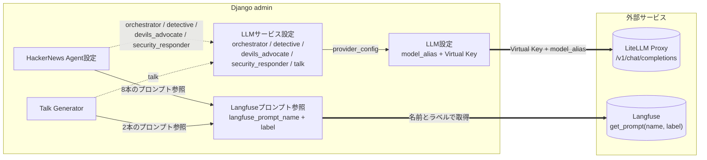
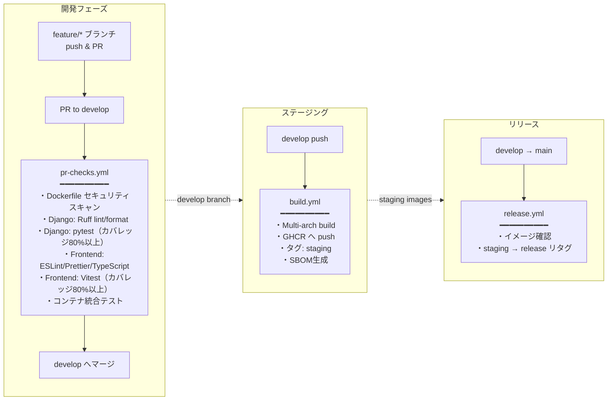

# 鍵山製パン社内 Web アプリケーション

> **Docker × Django REST × React SPA で構築する社内ツール基盤。**
> LiteLLM Proxy + Langfuse で LLMOps を一元化し、ChatGPT 風の **チャット履歴付き音声会話**、テキスト読み上げ、OneDrive / Outlook 連携、HackerNews 監視エージェントなどを統合。

[](https://www.python.org/)
[](https://www.djangoproject.com/)
[](https://react.dev/)
[](https://www.typescriptlang.org/)
[](https://vitejs.dev/)
[](https://tailwindcss.com/)
[](https://www.postgresql.org/)
[](https://pnpm.io/)

[](https://www.docker.com/)
[](https://docs.docker.com/compose/)
[](https://github.com/features/actions)

## 概要

Docker コンテナベースの Web アプリケーションです。React SPA フロントエンドと Django REST API バックエンドで構成されています。
LLM 呼び出しは LiteLLM Proxy 経由でプロバイダー非依存、観測とプロンプト管理は Langfuse に集約しています。
本番環境のデプロイとリバースプロキシ（Traefik）は [internal.kagiyama.net](https://github.com/kagiyama-baking/internal.kagiyama.net) リポジトリ（Ansible）が管理します。

## サービス

- 🌐 **Frontend**: React SPA（テキスト読み上げ・チャット履歴・メディア変換の操作画面、モバイル対応 2 ペイン UI）
- 🐍 **Django API**: REST API で複数の機能を提供するバックエンドサーバ
    - 🔐 **User**: ユーザー認証・管理機能
    - **integrations/** - 外部サービス連携
        - 🤖 **LLM**: LiteLLM Proxy 経由の LLM クライアント（プロバイダー非依存・Langfuse 自動トレース）
        - 🔭 **Langfuse**: プロンプト管理モデル `LangfusePromptRef`（HN Agent / Talk が参照）+ Sessions 機能でチャット会話を集約観測
        - 🔗 **MS Graph**: Microsoft Graph API 設定・認証・クライアント
        - ☁️ **OneDrive**: Microsoft OneDrive との統合機能
        - 📅 **Outlook**: Outlook Calendar 予定取得機能
        - 🔊 **TTS**: テキスト読み上げ（Style-BERT-VITS2 プロキシ）
        - 🌤️ **Weather**: 気象庁天気予報 API
        - 📰 **HN**: Hacker News Algolia API クライアント
        - 🔍 **Tavily**: Tavily Web 検索 API クライアント
        - 💬 **Slack**: Slack Incoming Webhook 通知クライアント
    - **features/** - ビジネス機能
        - 🎙️ **Talk**: 会話生成 API + **チャット履歴セッション**（DB + ファイル永続化、編集再送、音声配信/個別 & 一括削除、LLM タイトル要約、Langfuse Session 連携）
        - 📁 **Media**: メディア変換（画像フォーマット変換、ZIP → PDF）
        - 🕵️ **HackerNews Agent**: HN 監視・分析エージェント（Watcher → Orchestrator → Detective / Devil's Advocate / Security Responder → Slack 通知。LangGraph ReAct Agent がスレッド性質に応じて 3 ツールを使い分け）
- 🎤 **Style-BERT-VITS2 API**: 日本語音声合成サービス（CPU 推論・NVIDIA GPU はオプション）

## LLM / LiteLLM / Langfuse の関係

このプロジェクトでは LLM 周辺を 3 つのレイヤに分離しています。

| レイヤ | 責務 | 管理場所 |
|---|---|---|
| **LLM 接続** | 「どのモデルに、どの鍵で繋ぐか」 | Django admin の「LLM設定」「LLMサービス設定」 |
| **プロンプト管理** | 「どのテキストを渡すか」 | Django admin の「Langfuseプロンプト参照」+ Langfuse UI |
| **機能設定** | 「いつ・どのプロンプトで呼ぶか」 | Django admin の「HackerNews Agent設定」「Talk Generator」 |

### 構成要素

- **LiteLLM Proxy**（外部サービス / internal.kagiyama.net 管理）
  OpenAI 互換エンドポイントで、`model_alias`（例: `bedrock/moonshotai.kimi-k2.5`）を受けて実プロバイダーへルーティング。モデル差し替え・コスト集計・Virtual Key 発行を一元化。
- **Langfuse**（外部サービス / SaaS or self-hosted）
  LLM 呼び出しの観測（traces / generations / spans）と、バージョン管理付きのプロンプトテンプレート（`prompt.compile(**vars)`）を提供。
- **`LLMProviderConfig`** / **`LLMServiceConfig`**（Django DB）
  モデルエイリアス + Virtual Key をサービスごと（`orchestrator` / `detective` / `devils_advocate` / `security_responder` / `talk`）に割り当て。
- **`LangfusePromptRef`**（Django DB）
  Django 内識別名 ↔ Langfuse プロンプト名のマッピング + `fallback_text`。各機能（`HNAgentConfig` / `TalkConfig`）から FK で参照。
- **`resolve_prompt(ref, **vars)`**（ユーティリティ）
  Langfuse から取得してコンパイル、失敗時は `fallback_text` を Mustache 風に簡易置換。

### admin 項目と外部サービスのつながり



- **実線**（admin 内）: FK 参照
- **破線**（admin 内）: `service_name` 経由の紐付け
- **太線**（admin → 外部）: ランタイムで実際に叩く API

### Langfuse プロンプトの命名規約（運用）

| 用途 | Langfuse プロンプト名 |
|---|---|
| HN Agent Orchestrator system | `hn-agent-orchestrator` |
| HN Agent Orchestrator user | `hn-agent-orchestrator-user` |
| HN Agent Detective system | `hn-agent-detective` |
| HN Agent Detective user | `hn-agent-detective-user` |
| HN Agent Devil's Advocate system | `hn-agent-devils-advocate` |
| HN Agent Devil's Advocate user | `hn-agent-devils-advocate-user` |
| HN Agent Security Responder system | `hn-agent-security-responder` |
| HN Agent Security Responder user | `hn-agent-security-responder-user` |
| Talk system | `talk-{config_name}-system` |
| Talk user | `talk-{config_name}-user` |

Langfuse 未登録でも `LangfusePromptRef.fallback_text` があれば動作します。登録すると Langfuse UI 上でバージョン管理・A/B テスト・staging/production ラベル切り替えが可能になります。

## 特徴

- 🌐 **モダン SPA**: React 19 + TypeScript + Tailwind CSS v4 + shadcn/ui
- 💬 **チャット履歴永続化**: ChatGPT 風の 2 ペイン UI、編集再送、音声一括再生 / DL（iOS Safari の autoplay にも対応）、モバイルドロワー
- 🚀 **CI/CD**: GitHub Actions による自動ビルド・テスト・リリース
- 📦 **コンテナレジストリ**: GitHub Container Registry へのイメージ公開
- 🔐 **ビルド証明**: SLSA Build Provenance による信頼性の担保
- 📋 **SBOM**: ソフトウェア部品表（CycloneDX）の自動生成
- 🛡️ **脆弱性スキャン**: Trivy によるイメージ検査
- 🔒 **暗号化**: 機密情報の暗号化保存（MS Graph 秘密鍵、LiteLLM Virtual Key など）
- 🔭 **LLM 観測**: Langfuse によるトレース・プロンプトバージョニング・**Sessions** によるチャット集約
- ✅ **テスト**: pytest（バックエンド）+ Vitest + Playwright（フロントエンド）

## プロジェクト構成

```
kawashiro-server/
├── docker-compose.yml          # 開発用のDocker Compose設定
├── README.md                   # このファイル
│
├── .github/workflows/          # GitHub Actionsワークフロー
│   ├── build.yml               # ビルド・プッシュ（develop）
│   ├── release.yml             # リリースタグ付け（main）
│   ├── pr-checks.yml           # PRチェック
│   └── cleanup-images.yml      # 古いイメージのクリーンアップ
│
├── frontend/                   # React SPA フロントエンド
│   ├── Dockerfile              # マルチステージ（node → nginx）
│   ├── src/
│   │   ├── components/         # UIコンポーネント
│   │   ├── features/           # 画面（home, login, tts, talk, media）
│   │   ├── lib/                # APIクライアント / format / audio 結合
│   │   └── stores/             # Zustand ストア（auth, tts, chat）
│   ├── tests/                  # Vitest ユニットテスト
│   └── e2e/                    # Playwright E2E テスト
│
├── django_api/                 # Django REST API
│   ├── django_api/             # プロジェクト設定
│   ├── core/                   # コアアプリ（Userモデル、暗号化、admin並び制御）
│   ├── user/                   # ユーザー認証アプリ
│   ├── integrations/
│   │   ├── llm/                # LLMProviderConfig / LLMServiceConfig / LLMClient
│   │   ├── langfuse/           # LangfusePromptRef / resolve_prompt
│   │   ├── msgraph/            # Microsoft Graph 設定・クライアント
│   │   ├── onedrive/           # OneDrive 連携 API
│   │   ├── outlook/            # Outlook Calendar 連携 API
│   │   ├── tts/                # TTS 読み上げ
│   │   ├── weather/            # 気象庁天気予報
│   │   ├── hn/                 # Hacker News Algolia クライアント
│   │   ├── tavily/             # Tavily Web 検索クライアント
│   │   └── slack/              # Slack Incoming Webhook
│   ├── features/
│   │   ├── talk/               # Talk Generator + チャット履歴セッション
│   │   │   ├── views/          # synthesize / sessions / messages / audio に分割
│   │   │   ├── models.py       # TalkConfig / ChatSession / ChatMessage
│   │   │   ├── services.py     # synthesize_chat / generate_session_title
│   │   │   └── signals.py      # post_delete で音声ファイル物理削除
│   │   ├── media/              # メディア変換
│   │   └── hn_agent/           # HackerNews Agent
│   └── tests/                  # テストコード
│
├── volumes/
│   └── media/                  # チャット履歴の TTS 音声永続化先（ホストマウント）
│
└── sbv2_api/                   # Style-BERT-VITS2 APIサーバー（CPU推論 / オプションでCUDA 11.8）
```

## 必要な環境

- Docker Engine 20.10.0+
- Docker Compose 2.0.0+
- （オプション）NVIDIA GPU + [NVIDIA Container Toolkit](https://docs.nvidia.com/datacenter/cloud-native/container-toolkit/latest/install-guide.html)
  - sbv2-api はデフォルトで CPU 推論のため GPU なしのホスト（Intel Mac mini 等）でも動作します
  - GPU で推論する場合は `docker compose -f docker-compose.yml -f docker-compose.gpu.yml up -d` を使用
- 外部サービス
  - LiteLLM Proxy エンドポイント（`LITELLM_PROXY_URL`）
  - Langfuse SaaS or self-hosted（`LANGFUSE_BASE_URL` など任意）

## インストール・セットアップ

### 1. リポジトリのクローン

```bash
git clone https://github.com/kagiyama-baking/kawashiro-server.git
cd kawashiro-server
```

### 2. 環境変数の設定

```bash
cp django_api/.env.sample django_api/.env
nano django_api/.env
```

### 3. 永続化ディレクトリの準備

```bash
sudo mkdir -p /opt/app/django-api/staticfiles
sudo chown -R $USER:$USER /opt/app/
```

### 4. サーバーの起動

```bash
docker compose up -d
docker compose logs -f
```

### 5. 動作確認

```bash
curl http://localhost:8000/health/    # Django API
curl http://localhost:3000/           # Frontend
```

## 環境変数設定

`django_api/.env` に以下を設定します（`.env.sample` 参照）。

| カテゴリ | 変数 | 説明 |
|---|---|---|
| Django | `SECRET_KEY` | 必須 |
| Django | `DEBUG` | デフォルト `False` |
| Django | `ALLOWED_HOSTS` | カンマ区切り、デフォルト `localhost` |
| Django | `ENCRYPTION_KEY` | DB 内機密情報の暗号化（MS Graph 秘密鍵、LiteLLM Virtual Key 等） |
| Django | `CSRF_TRUSTED_ORIGINS` | 本番時に Traefik 経由のドメインを指定 |
| DB | `DB_ENGINE` / `DB_*` | PostgreSQL 接続情報 |
| Celery | `CELERY_BROKER_URL` / `CELERY_RESULT_BACKEND` | デフォルト `redis://redis:6379/0` |
| TTS | `TTS_SERVICE_URL` | デフォルト `http://sbv2-api:5000` |
| LLM | `LITELLM_PROXY_URL` | LiteLLM Proxy のベース URL（例: `http://litellm-proxy:4000/v1`） |
| LLM | `LITELLM_MASTER_KEY` | LLMProviderConfig.proxy_api_key が未設定時のフォールバック |
| Langfuse | `LANGFUSE_PUBLIC_KEY` / `LANGFUSE_SECRET_KEY` | Langfuse 認証（任意。未設定時はトレース・プロンプト取得を skip） |
| Langfuse | `LANGFUSE_BASE_URL` | self-hosted 使用時のみ（未指定時はクラウド） |
| Langfuse | `LANGFUSE_TRACING_ENVIRONMENT` | `dev` / `prd` |

> **Note:** OpenAI / Bedrock 等の**プロバイダー側 API キー**は LiteLLM Proxy 側で管理します。Django 側では LiteLLM Virtual Key のみを扱います（`LLMProviderConfig.proxy_api_key`）。

## 使用方法

### サービスの管理

```bash
docker compose up -d                # 起動
docker compose down                 # 停止
docker compose restart              # 再起動
docker compose logs -f django-api   # ログ追跡
```

## CI/CD

### デプロイメントパイプライン

GitHub Actions による 3 段階パイプライン。本番デプロイは [internal.kagiyama.net](https://github.com/kagiyama-baking/internal.kagiyama.net)（Ansible）が担当します。



### ビルド対象サービス

| サービス | PR チェック | ビルド・プッシュ | リリース |
|---|---|---|---|
| django-api | ✓ | ✓ | ✓ |
| frontend | ✓ | ✓ | ✓ |
| sbv2-api | スキャンのみ | - | - |

> **Note:** `sbv2-api` は BERT モデル同梱でイメージが巨大なため CI 環境ではビルドしません。pytest によるユニットテストと Dockerfile のセキュリティスキャンを実施。

### コンテナイメージのタグ戦略

| タグ | 用途 | 更新タイミング |
|---|---|---|
| `staging` | ステージング環境 | develop ブランチ push |
| `release` | 本番環境 | main ブランチマージ |
| `latest` | 最新版（互換性） | main ブランチマージ |
| `sha-<commit>` | 特定バージョン | 各ビルド |

## テストの実行

### バックエンド（Django API）

```bash
cd django_api
uv run pytest tests/ -v --tb=short \
  --cov=user --cov=core --cov=integrations --cov=features \
  --cov-report=term-missing -m "not e2e"
```

### フロントエンド

```bash
cd frontend
pnpm test:ci       # ユニットテスト（カバレッジ付き）
pnpm test:e2e      # E2E テスト（Playwright）
```

## 技術スタック

### フロントエンド

- **React 19** / **Vite** / **TypeScript**
- **Tailwind CSS v4** / **shadcn/ui**
- **Zustand**（状態管理） / **ky**（HTTP）

### バックエンド

- **Django 6.0** + **Django REST Framework**
- **PostgreSQL 17**（pgvector 拡張対応）
- **Celery + Redis**（非同期・定期タスク）
- **uv**（高速 Python パッケージマネージャ）

### LLMOps

- **LiteLLM Proxy**（OpenAI 互換 + モデルルーティング）
- **LangChain / LangGraph**（HN Agent Orchestrator の ReAct Agent）
- **Langfuse**（トレース + プロンプト管理）

### インフラ・DevOps

- **Docker & Docker Compose**
- **nginx**（フロント配信 + API プロキシ）
- **Traefik**（リバースプロキシ / Ansible 側管理）
- **GitHub Actions** / **GitHub Container Registry**
- **Trivy**（セキュリティスキャナ）

### 外部サービス連携

- **Microsoft Graph API**（OneDrive / Outlook）
- **LiteLLM Proxy**（LLM 呼び出しの共通入口）
- **Langfuse**（観測 / プロンプト管理）
- **気象庁天気予報 API**
- **Style-BERT-VITS2**（音声合成・CPU / オプションで CUDA 11.8）
- **Hacker News Algolia API**
- **Tavily API**（Web 検索）
- **Slack Incoming Webhook**（通知）
