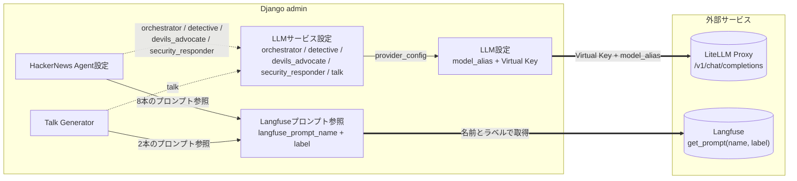

# Django API

REST API で複数の機能を提供するバックエンドサーバです。LLM 呼び出しは LiteLLM Proxy に集約し、観測とプロンプト管理は Langfuse に統一しています。

## 機能一覧

| アプリ | エンドポイント | 説明 |
|---|---|---|
| user | `/user/` | ユーザー認証・管理 |
| onedrive | `/onedrive/` | OneDrive ファイル連携 |
| outlook | `/outlook/` | Outlook Calendar 予定取得 |
| media | `/media/` | 画像変換・ZIP→PDF |
| tts | `/tts/` | テキスト読み上げ（Style-BERT-VITS2 プロキシ） |
| weather | `/weather/` | 気象庁天気予報 |
| talk | `/talk/` | 会話生成（Talk Generator）+ チャット履歴セッション API |
| hn-agent | `/hn-agent/` | HackerNews Agent（監視・調査・辛口分析・セキュリティ対応指針） |

## アーキテクチャの肝

### 責務分離: LLM 接続 / プロンプト管理 / 機能設定

LLM 周辺を 3 レイヤに分け、それぞれ Django admin で独立して管理します。

| レイヤ | モデル | 管理画面 | 役割 |
|---|---|---|---|
| LLM 接続 | `LLMProviderConfig` | 「LLM設定」 | モデルエイリアス + LiteLLM Virtual Key |
| LLM 接続 | `LLMServiceConfig` | 「LLMサービス設定」 | `orchestrator` / `detective` / `devils_advocate` / `security_responder` / `talk` にプロバイダ割り当て + タイムアウト |
| プロンプト管理 | `LangfusePromptRef` | 「Langfuseプロンプト参照」 | Langfuse プロンプト名 + ラベル + フォールバック |
| 機能設定 | `HNAgentConfig` | 「HackerNews Agent設定」 | 閾値、ポーリング、取得件数、使用プロンプト 8 本（Orchestrator / Detective / Devil's Advocate / Security Responder × system / user） |
| 機能設定 | `TalkConfig` | 「Talk Generator」 | プリセットごとの動作パラメータ + 使用プロンプト 2 本 + TTS |

**原則**: プロンプトとモデル接続が独立しているため、モデル差し替え（例: GPT-4o → Kimi K2.5）を行っても Langfuse 上のプロンプトは不変、プロンプト改修に Django 再デプロイは不要です。

### admin 項目と外部サービスのつながり



## セットアップ

### 1. 環境変数の設定

`.env.sample` を参考に `.env` を作成：

```bash
cp .env.sample .env
```

```env
# Django
SECRET_KEY=your-secret-key
DEBUG=False
ALLOWED_HOSTS=localhost,127.0.0.1
ENCRYPTION_KEY=your-encryption-key

# DB
DB_ENGINE=django.db.backends.postgresql
DB_NAME=kawashiro
DB_USER=kawashiro
DB_PASSWORD=kawashiro-dev
DB_HOST=app-database
DB_PORT=5432

# Celery
CELERY_BROKER_URL=redis://redis:6379/0

# TTS
TTS_SERVICE_URL=http://sbv2-api:5000

# LLM (LiteLLM Proxy)
LITELLM_PROXY_URL=http://litellm-proxy:4000/v1
LITELLM_MASTER_KEY=your-litellm-master-key

# Langfuse (任意)
LANGFUSE_PUBLIC_KEY=pk-lf-xxxx
LANGFUSE_SECRET_KEY=sk-lf-xxxx
LANGFUSE_BASE_URL=https://cloud.langfuse.com
LANGFUSE_TRACING_ENVIRONMENT=dev
```

> **Note:** プロバイダ側 API キー（OpenAI / Bedrock 等）は LiteLLM Proxy 側で管理します。Django 側は LiteLLM の Virtual Key（`LLMProviderConfig.proxy_api_key`、暗号化保存）のみを持ちます。

### 2. マイグレーション & 管理ユーザー作成

```bash
uv run ./manage.py migrate
uv run ./manage.py createsuperuser
```

### 3. サーバー起動

```bash
uv run ./manage.py runserver          # 開発
docker compose up -d django-api        # Docker
```

## 管理画面での設定

Django 管理画面（`http://localhost:8000/admin/`）は 3 グループに整列されています。

### 1. システム設定

`Core` / `認証と認可` / `認証トークン`

### 2. 外部サービス設定

#### Microsoft 365（OneDrive / Outlook 機能）

`Microsoft Graph API 設定` から：

| 項目 | 説明 |
|---|---|
| テナント ID | Azure AD テナント ID |
| クライアント ID | Azure AD アプリケーション ID |
| 証明書サムプリント | 証明書のサムプリント |
| 秘密鍵 | PEM 形式（暗号化保存） |
| 対象ユーザー | アクセス対象のメールアドレス |

#### Slack

Incoming Webhook URL（暗号化保存）

#### Tavily

Tavily Web 検索の API キー（暗号化保存）

#### Celery（Periodic Tasks）

`django-celery-beat` の定期タスクスケジューラー。HN Agent のポーリングはここで有効化します。

### 3. AI ツール設定

#### LLM 設定（`LLMProviderConfig`）

モデルエイリアス + LiteLLM Virtual Key の組み合わせを登録します。複数登録可能で、`LLMServiceConfig` から共有して参照できます。

| 項目 | 説明 |
|---|---|
| 設定名 | 識別名（例: `Kimi K2.5 本番`, `GPT-4o テスト`） |
| モデルエイリアス | LiteLLM Proxy の `model_name`（例: `bedrock/moonshotai.kimi-k2.5`） |
| Virtual Key | LiteLLM Virtual Key（暗号化保存、未設定時は `LITELLM_MASTER_KEY` を使用） |

#### LLM サービス設定（`LLMServiceConfig`）

各サービス（`orchestrator` / `detective` / `devils_advocate` / `security_responder` / `talk`）にどの `LLMProviderConfig` を使うかを割り当てます。

| 項目 | 説明 |
|---|---|
| サービス名 | `HN Agent Orchestrator` / `HN Agent Detective` / `HN Agent Devil's Advocate` / `HN Agent Security Responder` / `Talk Generator` |
| LLM 設定 | 使用する `LLMProviderConfig` を選択 |
| 有効 | サービス設定を有効化 |
| タイムアウト（秒） | API リクエストタイムアウト（デフォルト 60） |

> **Note:** `devils_advocate` / `security_responder` のサービス設定は migration 0012 で `detective` の設定を雛形として `is_active=False` で自動生成されます（detective が存在する場合）。プロバイダーを切り替えたい場合は管理画面で個別に編集してください。

#### Langfuse プロンプト参照（`LangfusePromptRef`）

Langfuse 上のプロンプトを Django 側で参照するためのマッピング。`HNAgentConfig` / `TalkConfig` から FK で選択します。

| 項目 | 説明 |
|---|---|
| 識別名 | Django 内の unique 名（例: `talk-morning-system`） |
| Langfuse プロンプト名 | Langfuse 上の実プロンプト名 |
| ラベル | `production` / `staging`（Langfuse の version ラベル） |
| フォールバックテキスト | Langfuse 不達時や未登録時に使用（`{{key}}` 変数は呼び出し側で置換） |

初期データとして HN Agent 用 8 種（`hn-agent-orchestrator-system` / `-user`、`hn-agent-detective-system` / `-user`、`hn-agent-devils-advocate-system` / `-user`、`hn-agent-security-responder-system` / `-user`）が migration 0002 + 0003 で自動投入されます。Talk 用は `TalkConfig` 作成時に自動生成されます。

#### HackerNews Agent 設定（`HNAgentConfig`）

| 項目 | 説明 |
|---|---|
| 有効 | この設定を有効化（1 つのみ） |
| 推論深度 | Orchestrator の reasoning 量（low/medium/high/無効） |
| スコア閾値 | 調査をトリガーするスコア（例: 100） |
| 速度閾値 | 調査をトリガーするスコア上昇速度（ポイント/時間） |
| ポーリング間隔（秒） | HN フロントページ取得の間隔（最低 60） |
| フロントページ取得件数 | 1 回のポーリングで取得する件数（デフォルト 30、Algolia 経由で 90 以上も可） |
| Orchestrator / Detective / Devil's Advocate / Security Responder × system / user | 8 本の `LangfusePromptRef` FK |

#### Talk Generator（`TalkConfig`）

プリセットごとに複数登録可能（`morning` / `evening` / `welcome_home` …）。

| 項目 | 説明 |
|---|---|
| 設定名 | API 呼び出し時の識別子（unique） |
| 表示名 | 管理画面での表示名 |
| 天気情報を使用 | `{{weather}}` プレースホルダーを有効化 |
| 予定情報を使用 | `{{events}}` プレースホルダーを有効化 |
| 日時情報を使用 | `{{datetime}}` プレースホルダーを有効化 |
| 予報区コード | 6 桁の数字（天気使用時のみ必須、例: `130010`） |
| TTS 設定 | 音声合成のモデル・スタイル・速度・フォーマット |
| システムプロンプト | `system_prompt_ref` で `LangfusePromptRef` を選択 |
| ユーザープロンプト | `user_prompt_ref` で `LangfusePromptRef` を選択 |

##### API 呼び出し例

```bash
# 設定一覧を取得
curl http://localhost:8000/talk/configs/ \
  -H "Authorization: Token YOUR_TOKEN"

# 会話生成（user_prompt はサーバー側管理のため不要）
curl -X POST http://localhost:8000/talk/synthesize/ \
  -H "Authorization: Token YOUR_TOKEN" \
  -H "Content-Type: application/json" \
  -d '{"config_name": "morning"}'
```

##### プレースホルダー

Langfuse 上のユーザープロンプトテンプレートで以下のプレースホルダーが使用可能です（`TalkConfig` で有効化されている場合のみ値が渡される）。

| プレースホルダー | 内容 | 設定 |
|---|---|---|
| `{{datetime}}` | 日時・曜日・祝日情報（JSON） | 日時情報を使用 |
| `{{weather}}` | 天気予報データ（JSON） | 天気情報を使用 |
| `{{events}}` | 本日の予定データ（JSON） | 予定情報を使用 |

#### チャット履歴セッション API

`TalkConfig` の人格を使い回しつつ、ChatGPT 風に過去発話を引き継いだ複数ターンの会話を行う API 群。データは PostgreSQL に永続化、TTS 音声は `MEDIA_ROOT` 配下にファイルとして保存し、Django ビュー経由で認可付き配信されます。

| メソッド | パス | 用途 |
|---|---|---|
| `GET`     | `/talk/sessions/`                                    | セッション一覧（LimitOffsetPagination, default_limit=20） |
| `POST`    | `/talk/sessions/`                                    | セッション新規作成（`config_name` を作成時に固定） |
| `GET`     | `/talk/sessions/<uuid>/`                             | 詳細（messages 含む。音声は `audio_url` 経由） |
| `PATCH`   | `/talk/sessions/<uuid>/`                             | タイトル更新 |
| `DELETE`  | `/talk/sessions/<uuid>/`                             | セッション削除（音声ファイルも cascade で物理削除） |
| `POST`    | `/talk/sessions/<uuid>/messages/`                    | ユーザー発話を送信し assistant 応答を生成（throttle: `talk_chat` 20/min） |
| `PATCH`   | `/talk/sessions/<uuid>/messages/<int>/`              | 編集再送（対象 user メッセージ以降を物理削除し再生成） |
| `GET`     | `/talk/sessions/<uuid>/audio/<int>/`                 | 認可付き音声 `FileResponse` |
| `DELETE`  | `/talk/sessions/<uuid>/audio/<int>/`                 | 個別メッセージの音声だけ削除（テキストは残す） |
| `DELETE`  | `/talk/sessions/<uuid>/audio/`                       | セッション内の音声を一括削除 |

主な特徴:

- **モデル**: `ChatSession`(UUID 主キー / user FK / config_name 固定 / title 自動生成) と `ChatMessage`(`(session, sequence)` UniqueConstraint / FileField)
- **タイトル LLM 自動生成**: 初回 assistant 応答後に `TalkService.generate_session_title` が 20 文字程度で要約。手動編集も可能
- **同時 POST 安全**: `select_for_update` で 50 件上限のレース防止
- **オーファン対策**: `transaction.atomic` の commit 後にファイル書き込み、シグナルで削除時の物理削除
- **Langfuse Sessions 連携**: 各 LLM 呼び出しトレースに `session_id`（UUID）を付与し、Langfuse UI のセッション機能で同一会話を集約観測

##### API 呼び出し例（チャット履歴）

```bash
# セッションを新規作成（プリセット = morning に固定）
curl -X POST http://localhost:8000/talk/sessions/ \
  -H "Authorization: Token YOUR_TOKEN" \
  -H "Content-Type: application/json" \
  -d '{"config_name": "morning"}'

# 発話を送信して assistant 応答（音声付き）を取得
curl -X POST http://localhost:8000/talk/sessions/<uuid>/messages/ \
  -H "Authorization: Token YOUR_TOKEN" \
  -H "Content-Type: application/json" \
  -d '{"content": "おはよう"}'

# 音声ファイルを取得（streaming）
curl http://localhost:8000/talk/sessions/<uuid>/audio/<msg_id>/ \
  -H "Authorization: Token YOUR_TOKEN" \
  --output reply.wav

# セッション内の音声を一括削除（テキストは残す）
curl -X DELETE http://localhost:8000/talk/sessions/<uuid>/audio/ \
  -H "Authorization: Token YOUR_TOKEN"
```

### HackerNews Agent API

| メソッド | パス | 説明 |
|---|---|---|
| `POST` | `/hn-agent/run-all/` | Watcher + Orchestrator 一括実行 |
| `POST` | `/hn-agent/watcher/run/` | Watcher のみ手動実行 |
| `POST` | `/hn-agent/investigate/` | 指定 `hn_id` を Orchestrator 調査 |
| `GET` | `/hn-agent/threads/` | 監視中スレッド一覧 |

## テストの実行

```bash
# 全テスト（e2e 除外、カバレッジ付き）
uv run pytest tests/ -v --tb=short \
  --cov=user --cov=core --cov=integrations --cov=features \
  --cov-report=term-missing --cov-fail-under=80 -m "not e2e"

# 特定のアプリのみ
uv run pytest tests/features/talk/
uv run pytest tests/features/hn_agent/
uv run pytest tests/integrations/langfuse/
```

## API ドキュメント

| UI | パス |
|---|---|
| Swagger UI | `http://localhost:8000/swagger/` |
| ReDoc | `http://localhost:8000/redoc/` |
| OpenAPI スキーマ | `http://localhost:8000/schema/` |
