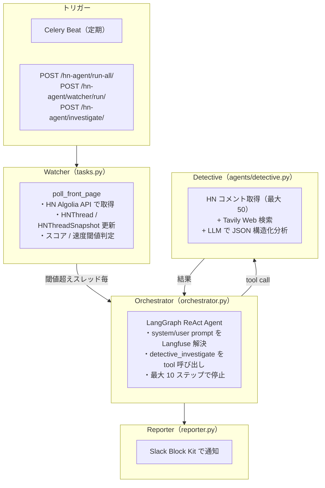
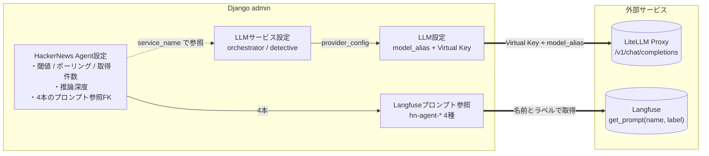

# HackerNews Agent — HN 監視・分析エージェント

## 目的

Hacker News のフロントページを定期監視し、急上昇するスレッドを検出して **AI が自律的に調査・分析**するエージェントシステム。「なぜ急上昇しているか」「コミュニティ内で意見が割れているか」を AI が判断して調査し、結果を Slack に通知します。

## 全体アーキテクチャ



## admin 項目と外部サービスのつながり

HN Agent が使う admin 設定と、実際に叩く外部サービスの対応関係です。



## 各コンポーネント詳細

### Watcher（`tasks.py`: `poll_front_page`）

HN フロントページを定期ポーリングし、スナップショットを蓄積。

- **入力**: なし（Celery Beat または `POST /hn-agent/watcher/run/` による手動トリガー）
- **処理**
  1. HN Algolia API で `HNAgentConfig.front_page_limit` 件を取得（デフォルト 30）
  2. `HNThread` を `get_or_create`
  3. `HNThreadSnapshot` にスコア・コメント数を時系列記録
  4. 前回スナップショットとの差分から**スコア上昇速度**を計算
  5. `score_threshold` または `velocity_threshold` を超えたスレッドを検出
  6. `auto_investigate=True` の場合、Orchestrator を Celery タスクとして起動
- **出力**: 取得件数、新規スレッド数、トリガー数

### Orchestrator（`orchestrator.py`）

LangGraph の **ReAct Agent** を使い、LLM が「次のステップ」を自律判断。

- **入力**: 調査対象 `HNThread`
- **処理**
  1. `HNAgentConfig.objects.get_active_config()` で有効設定を取得
  2. `LLMClient(service_name="orchestrator")` 相当の `ChatOpenAI` を構築
  3. `resolve_prompt(config.orchestrator_system_prompt)` で system prompt 解決
  4. `resolve_prompt(config.orchestrator_user_prompt, hn_id=..., title=..., …)` で user prompt 解決
  5. `create_react_agent(llm, [detective_investigate])` で ReAct Agent を構築
  6. エージェントが `detective_investigate` ツールを 1 回呼び、結論を出力
  7. Reporter に結果を渡して Slack 通知
- **特徴**
  - `@observe(name="hn-agent/orchestrator", as_type="agent")` で Langfuse 上に agent span
  - `_finalize_trace` で `decision_log`（実行ステップ一覧）をメタデータに記録

### Detective Agent（`agents/detective.py`）

スレッド急上昇の原因を総合分析。

- **入力**: 調査対象 `HNThread`
- **処理**
  1. HN Algolia API でコメントを再帰取得（最大 50 件）
  2. Tavily API で投稿者・トピックの背景情報検索（設定なしの場合は skip）
  3. `resolve_prompt(config.detective_system_prompt)` / `config.detective_user_prompt` で system/user prompt 解決
  4. `LLMClient(service_name="detective").generate_text(...)` で分析
  5. LLM の応答を JSON パース（`title_ja` / `why_trending` / `comment_highlights` など）
- **出力**: 構造化分析結果（Slack 通知用）
- **副作用**: `HNThread.is_investigated = True`
- **特徴**
  - `@observe(name="hn-agent/detective", as_type="tool")` で Orchestrator の子スパンとして記録

### Reporter（`reporter.py`）

調査結果を Slack Block Kit でフォーマットして通知。

## データモデル

| モデル | 説明 |
|---|---|
| `HNThread` | HN スレッドの基本情報（`hn_id`, `title`, `url`, `author`, `is_investigated`） |
| `HNThreadSnapshot` | スコア・コメント数の時系列スナップショット（上昇速度の計算用） |
| `HNAgentConfig` | エージェント動作パラメータ + 使用プロンプト 4 本（`LangfusePromptRef` FK） |

※ `Memory Agent` / `ThreadEmbedding` / `Investigation` モデルは廃止されました（Langfuse トレースで代替）。

## 設定の管理

Django 管理画面から（表示順は「AI ツール設定」グループ）:

| 設定画面 | 管理内容 |
|---|---|
| **LLM 設定**（`LLMProviderConfig`） | モデルエイリアス + LiteLLM Virtual Key |
| **LLM サービス設定**（`LLMServiceConfig`） | `orchestrator` / `detective` にプロバイダを割り当て |
| **Langfuse プロンプト参照**（`LangfusePromptRef`） | `hn-agent-orchestrator-system/-user`, `hn-agent-detective-system/-user` の 4 本 |
| **Slack 通知設定** | Webhook URL（暗号化保存） |
| **Tavily** | API キー（Web 検索、任意） |
| **HackerNews Agent 設定**（`HNAgentConfig`） | 推論深度、スコア閾値、速度閾値、ポーリング間隔、フロントページ取得件数、プロンプト 4 本 |

## API エンドポイント

| メソッド | パス | 説明 |
|---|---|---|
| `POST` | `/hn-agent/run-all/` | Watcher + Orchestrator 一括実行 |
| `POST` | `/hn-agent/watcher/run/` | Watcher のみ手動実行 |
| `POST` | `/hn-agent/investigate/` | 指定 `hn_id` を Orchestrator 調査 |
| `GET` | `/hn-agent/threads/` | 監視中スレッド一覧 |

## ファイル構成

```
features/hn_agent/
├── models.py                 # HNThread / HNThreadSnapshot / HNAgentConfig
├── tasks.py                  # Celery タスク（poll_front_page, run_orchestrator, cleanup_old_snapshots）
├── orchestrator.py           # LangGraph ReAct Agent ベースの Orchestrator
├── reporter.py               # Slack Block Kit フォーマッター
├── views.py                  # DRF API ビュー
├── serializers.py            # DRF シリアライザ
├── urls.py                   # URL ルーティング
├── admin.py                  # Django 管理画面設定
├── agents/
│   └── detective.py          # Detective Agent（背景調査 + LLM 分析）
└── management/
    └── commands/
        ├── run_hn_watcher.py       # Watcher 手動実行
        └── run_hn_investigation.py # Orchestrator 手動実行
```

## LLMOps（Langfuse 統合）

### プロンプト管理

| Langfuse プロンプト名 | 用途 |
|---|---|
| `hn-agent-orchestrator` | Orchestrator の system プロンプト |
| `hn-agent-orchestrator-user` | Orchestrator の user プロンプト（`{{hn_id}}`, `{{title}}`, `{{url}}`, `{{author}}`, `{{score_info}}` を変数として使用） |
| `hn-agent-detective` | Detective の system プロンプト（JSON スキーマ指定） |
| `hn-agent-detective-user` | Detective の user プロンプト（`{{title}}`, `{{url}}`, `{{author}}`, `{{score_info}}`, `{{background_section}}`, `{{comments_section}}`） |

Langfuse 未登録でも `LangfusePromptRef.fallback_text`（migration 0002 で投入済み）で動作します。

### トレーシング

- `langfuse.openai.OpenAI` drop-in wrapper により、全 LLM 呼び出しが自動でトレース・記録
- `@observe` デコレータで API エントリーポイント / Orchestrator / Detective に span 階層を構築
- Orchestrator の `_finalize_trace` で判断ログを `decision_log` としてメタデータ保存

### 環境変数

| 変数 | 説明 |
|---|---|
| `LANGFUSE_SECRET_KEY` / `LANGFUSE_PUBLIC_KEY` | Langfuse 認証 |
| `LANGFUSE_BASE_URL` | self-hosted 使用時のみ |
| `LANGFUSE_TRACING_ENVIRONMENT` | `dev` / `prd` |

## 依存する外部サービス

| サービス | 用途 | 必須 |
|---|---|---|
| LiteLLM Proxy | LLM 呼び出しの共通入口（プロバイダー非依存） | 必須 |
| HN Algolia API | スレッド・コメント取得 | 必須（無料） |
| PostgreSQL | スレッド・スナップショット保存 | 必須 |
| Redis | Celery ブローカー | 必須（定期実行時） |
| Tavily API | Web 検索（背景調査） | 任意（未設定時は skip） |
| Slack Webhook | 調査結果通知 | 任意（未設定時は skip） |
| Langfuse | LLM トレーシング・プロンプト管理 | 任意（未設定時は fallback_text で動作） |
