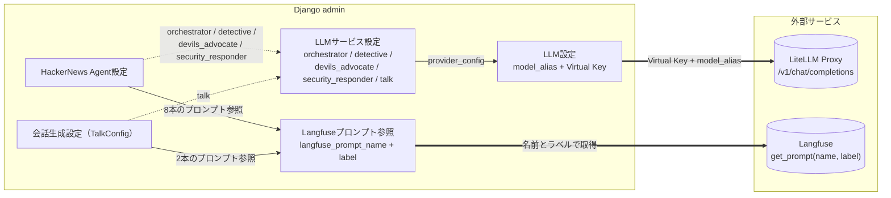

# LLM / Langfuse 統合（integrations/llm + integrations/langfuse）

LLM 接続・プロンプト管理・観測に関する **唯一の正（SSOT）** です。`integrations/llm`（Django アプリラベル `llm_config`）と `integrations/langfuse`（同 `langfuse_integration`）の 2 アプリをまとめて扱います。

## 1. 概要と 3 レイヤ責務分離

「どのモデルに繋ぐか」「どのテキストを渡すか」「いつ呼ぶか」を独立して差し替えられるよう、3 つのレイヤに分離しています。

| レイヤ | 責務 | 管理場所 | 実体 |
|---|---|---|---|
| **LLM 接続** | どのモデルに、どの鍵で繋ぐか | Django admin「LLM設定」「LLMサービス設定」 | `LLMProviderConfig` / `LLMServiceConfig` |
| **プロンプト管理** | どのテキストを渡すか | Django admin「Langfuseプロンプト参照」+ Langfuse UI | `LangfusePromptRef` + Langfuse 側のプロンプト実体 |
| **機能設定** | いつ・どのプロンプトで呼ぶか | Django admin「HackerNews Agent設定」「会話生成設定」 | `HNAgentConfig` / `TalkConfig` |

モデルを差し替えるときは admin の「LLM設定」だけ、プロンプトを変えるときは Langfuse UI だけを触ればよく、コード変更もデプロイも不要です。

## 2. 構成要素

- **LiteLLM Proxy**（外部サービス / internal.kagiyama.net 管理）
  OpenAI 互換エンドポイント。`model_alias`（例: `bedrock/moonshotai.kimi-k2.5`）を受けて実プロバイダーへルーティングし、モデル差し替え・コスト集計・Virtual Key 発行を一元化します。接続先は環境変数 `LITELLM_PROXY_URL`（既定 `http://litellm-proxy:4000/v1`）。
- **Langfuse**（外部サービス / SaaS or self-hosted）
  LLM 呼び出しの観測（traces / generations / spans）と、バージョン管理付きプロンプトテンプレートを提供。環境変数 `LANGFUSE_SECRET_KEY` / `LANGFUSE_PUBLIC_KEY` / `LANGFUSE_BASE_URL` / `LANGFUSE_TRACING_ENVIRONMENT` で設定します。
- **`LLMProviderConfig`**（`integrations/llm/models.py`）
  モデルエイリアス + LiteLLM Virtual Key の組。複数の `LLMServiceConfig` から共有参照できます。
- **`LLMServiceConfig`**（同上）
  サービス（`orchestrator` / `detective` / `devils_advocate` / `security_responder` / `talk`）ごとに、使用する `LLMProviderConfig`・有効フラグ・タイムアウトを割り当てます。
- **`LangfusePromptRef`**（`integrations/langfuse/models.py`）
  Django 内識別名 ↔ Langfuse プロンプト名のマッピング + `fallback_text`。`HNAgentConfig` / `TalkConfig` から FK で参照されます。
- **`get_llm_settings(service_name)`**（`integrations/llm/config.py`）
  `is_active=True` の `LLMServiceConfig` を引いて `LLMSettings` を返します。該当なしなら `LLMConfigurationError`。
- **`LLMClient`**（`integrations/llm/client.py`）
  `get_llm_settings` の結果で構成されるクライアント。
- **`resolve_prompt(ref, **vars)` / `get_prompt_with_variables(ref)`**（`integrations/langfuse/client.py`）
  Langfuse から取得してコンパイル、失敗時は `fallback_text` を Mustache 風に簡易置換します。

## 3. admin 設定と外部サービスの対応



- **実線**（admin 内）: FK 参照
- **破線**（admin 内）: `service_name` 経由の紐付け（FK ではなく文字列一致）
- **太線**（admin → 外部）: ランタイムで実際に叩く API

## 4. admin モデルリファレンス

### LLM 設定（`LLMProviderConfig`）

| 項目 | 説明 |
|---|---|
| 設定名（`name`） | 識別名。**unique**（例: `Kimi K2.5 本番`, `GPT-4o テスト`） |
| モデルエイリアス（`model_alias`） | LiteLLM Proxy の `model_name`（例: `bedrock/moonshotai.kimi-k2.5`） |
| Virtual Key（`proxy_api_key`） | LiteLLM Virtual Key。**暗号化して保存**（DB カラム `encrypted_proxy_api_key`）。admin ではパスワード入力欄で、既存値は再表示されません |

> **Note:** Virtual Key を空にすると環境変数 `LITELLM_MASTER_KEY` にフォールバックします。マスターキーではなくサービス専用の Virtual Key を使うと、コスト上限の設定とアクセスログの識別が可能になります。

### LLM サービス設定（`LLMServiceConfig`）

| 項目 | 説明 |
|---|---|
| サービス名（`service_name`） | `HN Agent Orchestrator` / `HN Agent Detective` / `HN Agent Devil's Advocate` / `HN Agent Security Responder` / `Talk Generator` の 5 択。**unique**（1 サービス 1 レコード） |
| LLM 設定（`provider_config`） | 使用する `LLMProviderConfig`。`on_delete=PROTECT` のため、参照中の設定は削除できません |
| 有効（`is_active`） | 既定 `True`。**`False` のレコードは `get_llm_settings` から見えず、設定なし扱いでエラーになります** |
| タイムアウト（`timeout`） | API リクエストのタイムアウト秒数（既定 `60`） |

> **Note:** `devils_advocate` / `security_responder` のレコードは migration `llm/0012` で `detective` を雛形として複製生成されます（`provider_config` と `timeout` を引き継ぎ、**`is_active=False`**）。detective が未設定の環境では何も生成されないため、admin から手動作成してください。いずれの場合も、使う前に有効化とプロバイダーの見直しが必要です。

### Langfuse プロンプト参照（`LangfusePromptRef`）

| 項目 | 説明 |
|---|---|
| 識別名（`name`） | Django 内で一意の名前。**unique**（例: `hn-agent-orchestrator-system`, `talk-morning-system`） |
| Langfuse プロンプト名（`langfuse_prompt_name`） | Langfuse 上の実プロンプト名。**識別名と一致するとは限りません**（§5 参照） |
| ラベル（`label`） | Langfuse のプロンプトラベル（既定 `production`。`staging` 等に切り替え可能） |
| フォールバックテキスト（`fallback_text`） | Langfuse 不達・未登録時に使うテキスト。`{{key}}` は呼び出し側の変数で簡易置換 |
| 説明（`description`） | 用途説明（admin 一覧に表示） |

## 5. Langfuse プロンプト命名規約

Django 側の識別名と Langfuse 側のプロンプト名は別物です。HN Agent の **system プロンプトのみ Langfuse 側に `-system` が付きません**（歴史的経緯）。

| 用途 | Django 識別名（`name`） | Langfuse プロンプト名 |
|---|---|---|
| HN Agent Orchestrator system | `hn-agent-orchestrator-system` | `hn-agent-orchestrator` |
| HN Agent Orchestrator user | `hn-agent-orchestrator-user` | `hn-agent-orchestrator-user` |
| HN Agent Detective system | `hn-agent-detective-system` | `hn-agent-detective` |
| HN Agent Detective user | `hn-agent-detective-user` | `hn-agent-detective-user` |
| HN Agent Devil's Advocate system | `hn-agent-devils-advocate-system` | `hn-agent-devils-advocate` |
| HN Agent Devil's Advocate user | `hn-agent-devils-advocate-user` | `hn-agent-devils-advocate-user` |
| HN Agent Security Responder system | `hn-agent-security-responder-system` | `hn-agent-security-responder` |
| HN Agent Security Responder user | `hn-agent-security-responder-user` | `hn-agent-security-responder-user` |
| Talk system | `talk-{config_name}-system` | `talk-{config_name}-system`（同名） |
| Talk user | `talk-{config_name}-user` | `talk-{config_name}-user`（同名） |

**投入方法の違いに注意してください。**

- **HN Agent の 8 本**は migration `langfuse/0002`（orchestrator / detective の 4 本）と `langfuse/0003`（devils_advocate / security_responder の 4 本 + orchestrator system の `fallback_text` を V2 へ更新）で、`fallback_text` 入りの `LangfusePromptRef` として自動投入されます。
- **Talk の 2 本は自動生成されません。** migration `talk/0012` は「マイグレーション実行時点で存在した `TalkConfig`」の分だけ参照を作り、既存の `system_prompt` を `fallback_text` へ移管したものです。**その後に新しい `TalkConfig` を追加する場合は、`LangfusePromptRef` を admin で手動作成**してから FK に割り当ててください（`system_prompt_ref` / `user_prompt_ref` はどちらも必須・`PROTECT`）。

いずれの場合も、`LangfusePromptRef` があるのは Django 側のマッピングだけです。Langfuse 側にプロンプト実体を登録すると、Langfuse UI 上でバージョン管理・A/B テスト・`staging`/`production` ラベル切り替えが可能になります。未登録でも `fallback_text` で動作します。

## 6. LLMClient の使い方

`LLMClient(service_name=...)` は admin の設定を解決してクライアントを構成します。モデル名も API キーもコードに書きません。

```python
from integrations.llm.client import LLMClient
from integrations.llm.exceptions import LLMClientError, LLMConfigurationError, LLMTimeoutError
from integrations.langfuse.client import resolve_prompt

try:
    client = LLMClient(service_name="talk")  # admin の LLMサービス設定を解決
    system_prompt = resolve_prompt(config.system_prompt_ref)
    user_prompt = resolve_prompt(config.user_prompt_ref, weather="晴れ")

    text = client.generate_text(prompt=user_prompt, system_prompt=system_prompt)
except LLMConfigurationError:
    ...  # サービス設定が無い、または is_active=False
except LLMTimeoutError:
    ...  # timeout（既定 60 秒）超過
except LLMClientError:
    ...  # 接続失敗
```

- **トレーシング**: 内部クライアントは `langfuse.openai.OpenAI` のため、呼び出しは自動的に Langfuse の generation として記録されます。`service_name` と `environment` は `extra_body.metadata` に付与されます。呼び出し側の関数は `@observe(name="talk/chat")` 等でトレースをまとめ、チャットは `get_client().update_current_trace(session_id=...)` で Langfuse Sessions に集約しています。
- **タイムアウト**: `LLMServiceConfig.timeout`（既定 60 秒）が OpenAI クライアントに渡ります。コード側でハードコードしません。
- **Function Calling**: `chat_completion(messages, tools=..., tool_choice=...)` を使います。
- **`generate_embedding()` は現在どこからも呼ばれていません**（実装とテストのみ存在）。埋め込みを使っていた HN Agent のメモリ機能は migration `hn_agent/0009` / `0010` で削除済みです。
- **HN Agent Orchestrator は `LLMClient` を経由しません。** LangGraph ReAct Agent を使う都合上、`get_llm_settings("orchestrator")` の結果から LangChain の `ChatOpenAI` を直接構成しています（`features/hn_agent/orchestrator.py`）。設定の解決経路は共通なので、admin の操作は他サービスと同じです。

## 7. フェイルソフト挙動

外部サービスが落ちても機能全体は止まらない設計です。

| 状況 | 挙動 |
|---|---|
| Langfuse 未設定 / 接続失敗 / プロンプト未登録 | `fallback_text` を使用し、`{{key}}` を `render_template` で簡易置換。警告ログのみで処理継続 |
| Langfuse 側が Chat 型プロンプト | 未対応のため警告ログを出して `fallback_text` にフォールバック（対応しているのは Text 型のみ） |
| `langfuse` パッケージ未インストール | `ImportError` を捕捉して `fallback_text` にフォールバック |
| Langfuse への `session_id` 付与失敗 | 警告ログのみ。会話生成本体は継続 |
| `LLMProviderConfig` の Virtual Key 未設定 | 環境変数 `LITELLM_MASTER_KEY` にフォールバック |
| `LLMServiceConfig` が無い / `is_active=False` | `LLMConfigurationError`（**ここはフェイルソフトしません**。設定漏れは早期に顕在化させます） |

> **Note（pgvector）**: PostgreSQL の `vector` 拡張は migration `core/0002` で有効化され、`pgvector` パッケージも依存に残っています（過去のマイグレーションが import しているため）。ただし **現在 `VectorField` を持つモデルは 1 つもありません**。ベクトル検索機能は稼働していないので、拡張の存在をもって RAG が動いていると誤解しないでください。

## 8. 関連ドキュメント

| ドキュメント | 内容 |
|---|---|
| [../../features/hn_agent/README.md](../../features/hn_agent/README.md) | HN Agent の構成・`HNAgentConfig`・8 本のプロンプト割り当て |
| [../../features/talk/README.md](../../features/talk/README.md) | 会話生成・チャットセッション・`TalkConfig` のプロンプト変数 |
| [../../../docs/initial-setup.md](../../../docs/initial-setup.md) | 初回セットアップ手順（admin 設定・環境変数の投入順） |
| [../../README.md](../../README.md) | Django API 全体構成 |
