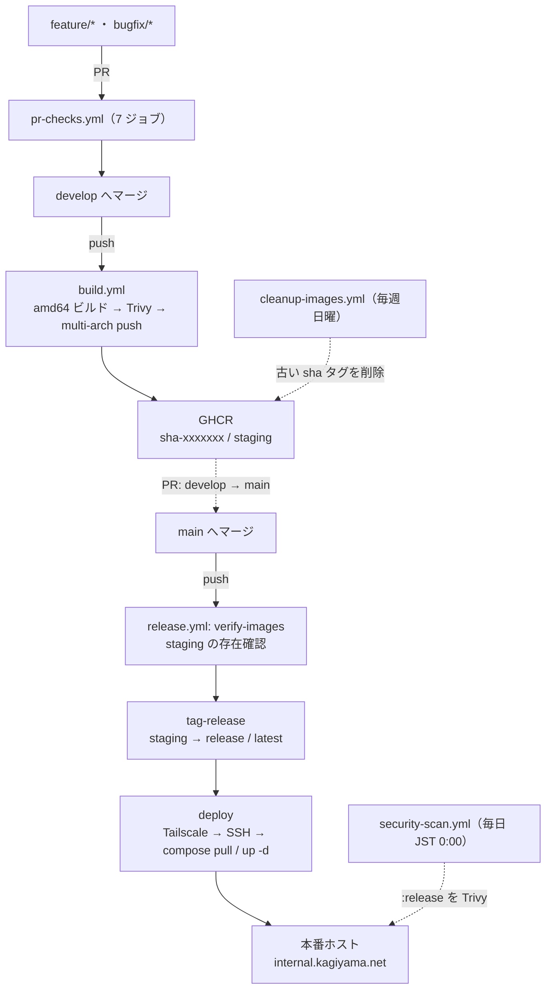

# デプロイ / リリースガイド

kawashiro-server の CI/CD・デプロイ・リリースに関する唯一の正（SSOT）です。
実装の根拠はすべて `.github/workflows/` 配下の 5 ファイルにあります。記述と実装が食い違った場合はワークフロー定義が正であり、このドキュメントを修正してください。

## 1. 責務境界（Ansible vs GitHub Actions）

**本番コンテナの入れ替えは GitHub Actions が行います。** Ansible（[internal.kagiyama.net](https://github.com/kagiyama-baking/internal.kagiyama.net)）が担当するのはホスト側の土台までです。

| 領域 | 担当 | 具体的な内容 |
| --- | --- | --- |
| ホストのプロビジョニング | Ansible | OS 設定、Docker インストール、Tailscale、ファイアウォール |
| リバースプロキシ | Ansible | Traefik の設定・証明書 |
| 本番 `docker-compose.yml` の配置 | Ansible | `DEPLOY_DIR`（`/opt/app`）へ配布。GHCR の `:release` タグを参照する |
| 本番 `.env` / シークレット配布 | Ansible | `TTS_SERVICE_URL` 等の本番値 |
| イメージのビルド・スキャン・push | GitHub Actions | `build.yml` |
| `staging` → `release` のリタグ | GitHub Actions | `release.yml` / `tag-release` |
| **本番コンテナの pull と再作成** | **GitHub Actions** | `release.yml` / `deploy`（Tailscale + SSH） |
| 脆弱性の継続監視 | GitHub Actions | `security-scan.yml`（毎日） |
| GHCR の容量管理 | GitHub Actions | `cleanup-images.yml`（毎週） |

> 補足: ルート `README.md` には「本番デプロイは internal.kagiyama.net（Ansible）が担当」とありますが、これは `release.yml` に `deploy` ジョブが追加される前の記述です。現在は上表のとおり、compose ファイルの配布までが Ansible、コンテナの入れ替えは Actions です。

## 2. パイプライン全体像



**ブランチ戦略**: `feature/*` / `bugfix/*` → PR → `develop` → PR → `main`。
実際の履歴でも `main` への直接コミットはなく、すべて `Merge pull request #NNN from kagiyama-baking/develop` の形で入っています。`main` への push が唯一のリリーストリガです。

## 3. ワークフロー詳細

### 3.1 `pr-checks.yml` — PR checks (develop)

トリガ: `develop` 宛の pull_request、および `workflow_dispatch`。
`.vscode/**` `.claude/**` `.gitignore` `**/*.md` `docs/**` の変更のみの場合はスキップされます（`paths-ignore`）。

| ジョブ | 実行条件 | 内容 |
| --- | --- | --- |
| `detect-changes` | 常時 | `dorny/paths-filter@v4` で `django_api/**` `sbv2_api/**` `frontend/**` `docker-compose.yml` の変更を検出 |
| `dockerfile-security-scan` | いずれか変更時 | Trivy の config スキャン（CRITICAL/HIGH で fail）を 3 サービス分マトリクス実行 |
| `django-api-test` | `django_api/**` | Python 3.13 + uv → `ruff check` / `ruff format --check` → CI 用 `.env` 生成 → `pytest --cov-fail-under=80`（`-m "not e2e"` は `pyproject.toml` の `addopts` 由来） |
| `sbv2-api-test` | `sbv2_api/**` | Python 3.10 + `uv sync --frozen` → ruff → pytest（`style_bert_vits2` / `torch` はスタブ化） |
| `frontend-static-checks` | `frontend/**` | pnpm + Node 22。ESLint / Prettier / TypeScript をマトリクスで並列実行 |
| `frontend-test` | `frontend/**`（静的チェック後） | `pnpm test:ci` → `pnpm build` |
| `container-integration-tests` | `django_api/**` または `docker-compose.yml` | compose ビルド → `migrate --run-syncdb` + `migrate --check` → `collectstatic --dry-run` → 起動 → `/health/` を最大 60 秒待機 → `/schema/` と `/swagger/` を検証 → 失敗時ログ出力 → `down -v` |

### 3.2 `build.yml` — Build & Push (develop)

トリガ: `develop` への push（`paths-ignore` は pr-checks と同一）、および `workflow_dispatch`。

1. `detect-changes`: `django_api/**` / `frontend/**` の変更からビルド対象マトリクスを組み立て（手動実行時は両方を強制的に対象化）
2. **amd64 のみでビルド**して `:scan` タグでランナーにロード（GitHub Actions cache を使用、`no-cache-filters: base`）
3. **Trivy スキャン**: CRITICAL/HIGH が 1 件でもあれば `exit-code: 1` で失敗（`ignore-unfixed: true` のため修正版のない脆弱性は除外）
4. スキャン通過後にのみ **amd64 + arm64 のマルチプラットフォームビルド**を実行し GHCR へ push（タグは `sha-<short>` と `staging`、`provenance: false`）
5. `anchore/sbom-action@v0` で SBOM をアーティファクト化（`sbom-<service>.spdx.json`）
6. `actions/attest-build-provenance@v4` でビルド証明を GHCR に付与（`workflow_dispatch` 時はスキップ、`continue-on-error: true`）
7. digest をアーティファクトとして保存し、ジョブサマリーへ出力

**sbv2-api はこのマトリクスに含まれません。** GHCR に sbv2-api のイメージは存在しません（詳細は §8）。

### 3.3 `release.yml` — Release (main)

トリガ: `main` への push、および `workflow_dispatch`。`concurrency` により同一 ref の実行は後勝ちでキャンセルされます。

| ジョブ | 内容 |
| --- | --- |
| `verify-images` | `django-api` / `frontend` の `:staging` を `docker manifest inspect` で確認。存在しなければ即失敗（`fail-fast: true`） |
| `tag-release` | `docker buildx imagetools create` で `staging` → `release` + `latest` をリタグし、**digest の一致を検証** |
| `deploy` | Tailscale 接続 → 本番ホストへ SSH → `docker compose pull` / `up -d`（詳細は §6） |
| `summary` | リリースされたイメージ・コミット SHA・日時をログ出力 |

**`buildx imagetools create` を使う理由**: 旧実装の `docker pull && docker tag && docker push` では、ランナー（amd64）用の単一アーキイメージだけが pull され、push 時に Docker v2 single image manifest として登録されて manifest list 構造が壊れていました。結果として `release` タグが `staging` と異なる digest を指し、arm64 イメージが取得不能になり、**本番が古いイメージで動き続ける障害**が発生しています（コミット `3f7504e`）。`imagetools create` は GHCR 内で manifest list をサーバサイドコピーするため digest が完全に保持されます。リタグ後の digest 一致検証は、同種の問題を CI で即座に検出するための仕組みです。**この 2 つは消さないでください。**

### 3.4 `security-scan.yml` — Security Scan

- スケジュール: `0 15 * * *`（UTC 15:00 = **JST 0:00、毎日**）。`workflow_dispatch` でも実行可能
- `django-api` / `frontend` の **`:release`**（＝本番が動かしているイメージ）を pull して Trivy スキャン
- CRITICAL/HIGH が存在すればワークフローは失敗する。`ignore-unfixed: false` のため、**修正版のない脆弱性も検出対象**（`build.yml` より厳しい基準）
- 別ステップで MEDIUM 以上を SARIF 出力し、`github/codeql-action/upload-sarif@v4` で **GitHub の Security タブ**へ報告（`exit-code: '0'` なので成否判定には影響しない）
- SARIF 生成/アップロードは `steps.pull.outcome == 'success'` を条件にしています。pull 失敗時に「Path does not exist」という真因を覆い隠すエラーが出るのを避けるためです

### 3.5 `cleanup-images.yml` — Cleanup old container images

- スケジュール: `0 0 * * 0`（**毎週日曜 UTC 0:00**）。`workflow_dispatch` の入力 `dry_run` は**既定 true**（スケジュール実行時は入力が空になるため `false` = 実削除）
- 対象: `django-api` / `frontend`。`cut-off: 2w`（2 週間より古い）かつ `keep-n-most-recent: 5`（最新 5 件は保持）
- `image-tags: '!latest !release !staging'` により重要タグは除外（この指定はタグ付きバージョンにのみ作用）
- **`snok/container-retention-policy` は v3.1.0 以上を維持すること。** v3.0.0 では manifest list が参照する untagged な子 manifest が削除対象になり、2026-05-17 の実行で untagged 23 件が消えて `django-api:release` が pull 不能（`manifest unknown`）になりました

## 4. イメージタグ運用

イメージ名は `ghcr.io/kagiyama-baking/kawashiro-server/<service>`（`release.yml` の `IMAGE_BASE` は `ghcr.io/${{ github.repository }}`）。

| タグ | 付与タイミング | 指すもの | 用途 |
| --- | --- | --- | --- |
| `sha-<short>` | `develop` への push ごと | そのコミットのビルド | 履歴・ロールバック先の特定 |
| `staging` | `develop` への push ごと（最新に移動） | `develop` の最新ビルド | リリース候補 |
| `release` | `main` への push 時 | リリース時点の `staging` と同一 digest | **本番の compose が参照するタグ** |
| `latest` | `main` への push 時 | `release` と同一 | 慣習的な別名 |

## 5. 必要な GitHub Secrets

`.github/workflows/` 内の `secrets.*` 参照を全件洗い出した結果です（`GITHUB_TOKEN` を除き 6 件）。

| Secret | 使用ワークフロー | 用途 |
| --- | --- | --- |
| `TS_OAUTH_CLIENT_ID` | `release.yml` | Tailscale OAuth クライアント ID。ランナーを `tag:ci` として tailnet に参加させる |
| `TS_OAUTH_SECRET` | `release.yml` | 同上のシークレット |
| `SSH_HOST` | `release.yml` | 本番ホスト（tailnet 上のホスト名 / IP） |
| `SSH_USER` | `release.yml` | SSH ログインユーザー |
| `DEPLOY_DIR` | `release.yml` | 本番 compose の配置先ディレクトリ（`/opt/app`） |
| `GHCR_CLEANUP_TOKEN` | `cleanup-images.yml` | GHCR のパッケージ削除権限を持つ PAT（`GITHUB_TOKEN` では削除できないため） |
| `GITHUB_TOKEN` | `build.yml` / `release.yml` / `security-scan.yml` | GHCR への login（自動発行、設定不要） |

**SSH 秘密鍵の Secret は存在しません。** 認証は Tailscale SSH（tailnet の ACL で `tag:ci` からの接続を許可）に委ねており、ACL 側の設定は internal.kagiyama.net の管理範囲です。

## 6. デプロイの実際（`release.yml` / `deploy`）

`tag-release` の成功後に実行されるステップです。

1. `tailscale/github-action@v4` で OAuth 認証し、ランナーを `tag:ci` として tailnet に参加させる
2. `ssh -o StrictHostKeyChecking=accept-new -o ConnectTimeout=30 ${SSH_USER}@${SSH_HOST}` でヒアドキュメントのスクリプトを実行:

```bash
set -euo pipefail
cd "${DEPLOY_DIR}"
docker compose pull django-api frontend                              # :release の新 digest を取得
docker compose up -d django-api celery-worker celery-beat frontend   # コンテナ再作成
docker image prune -f                                                # 旧イメージ削除
docker compose ps django-api celery-worker celery-beat frontend      # 結果確認
```

`pull` の対象が 2 サービスなのに `up -d` が 4 サービスなのは、**`celery-worker` と `celery-beat` が `django-api` と同一イメージを共有している**ためです（`docker-compose.yml` の `x-django-common` アンカー）。django-api のイメージを 1 回 pull すれば、3 サービスすべてが新しいイメージで再作成されます。

`app-database` / `redis` は再作成対象外です（外部イメージのため、更新は Ansible 側の責務）。

## 7. ロールバック手順

本番が壊れた場合、`release` タグを過去のビルドに差し戻すのが最短の復旧手段です。`tag-release` ジョブと同じ操作を手で行います。

**1. 戻したい `sha-<short>` タグを特定する**

```bash
gh api "/users/kagiyama-baking/packages/container/kawashiro-server%2Fdjango-api/versions" \
  --jq '.[] | {created: .created_at, tags: .metadata.container.tags}' | head -20
```

**2. `release` / `latest` を過去の digest にリタグする**（要 `docker login ghcr.io`、`write:packages` 権限の PAT）

```bash
IMAGE=ghcr.io/kagiyama-baking/kawashiro-server/django-api
docker buildx imagetools create \
    --tag "${IMAGE}:release" \
    --tag "${IMAGE}:latest" \
    "${IMAGE}:sha-xxxxxxx"

# digest が意図した版と一致するか確認
docker buildx imagetools inspect "${IMAGE}:release" --format '{{.Manifest.Digest}}'
```

`docker pull && docker tag && docker push` は使わないこと（§3.3 の理由により manifest list が壊れます）。frontend も戻す場合は同じ手順を `.../frontend` に対して実施します。

**3. 本番ホストで反映する**（`deploy` ジョブと同型）

```bash
ssh <SSH_USER>@<SSH_HOST>
cd /opt/app
docker compose pull django-api frontend
docker compose up -d django-api celery-worker celery-beat frontend
docker compose ps django-api celery-worker celery-beat frontend
```

**注意事項**

- **ロールバック可能な期間はおおむね 2 週間**です。`cleanup-images.yml` が 2 週間より古い `sha-*` タグを削除するため（最新 5 件は期間を問わず保持）、それ以前の版へは戻せません
- このリタグは**あくまで応急処置**です。`main` に次の push が入ると `staging` の内容で `release` が上書きされます。恒久対応として問題のコミットの revert を `develop` 経由で `main` まで通してください
- DB マイグレーションを含むリリースを戻す場合、イメージを戻すだけでは不整合が残ります。逆方向マイグレーションの要否を先に確認してください

## 8. sbv2-api のデプロイ

sbv2-api は **PR チェック（lint / pytest / Dockerfile スキャン）の対象ではありますが、イメージ配布パイプラインの対象外**です。`build.yml` のビルドマトリクスに含まれないため、GHCR に `sbv2-api` のイメージは存在せず、`release.yml` も一切関与しません。

実運用では、本番ホストではなく **GPU 搭載ホスト（NVIDIA GPU 付きの開発機）上でローカルビルドして常駐**させています。本番の django-api は `.env` の `TTS_SERVICE_URL` で、そのホストの Tailscale IP:5000 を直接参照します（値は Ansible 管理の本番 `.env` 側）。

```bash
# GPU ホスト側での更新手順
docker compose -f docker-compose.yml -f docker-compose.gpu.yml build sbv2-api
docker compose -f docker-compose.yml -f docker-compose.gpu.yml up -d sbv2-api
```

GPU 構成の詳細、モデル配置、`SBV2_DEVICE` などの環境変数は [`../sbv2_api/README.md`](../sbv2_api/README.md) を参照してください。

## 9. 関連ドキュメント

- [開発ガイド](./development.md) — ローカル環境構築、テスト、コーディング規約
- [プロジェクト README](../README.md) — システム全体像とサービス構成
- [sbv2_api README](../sbv2_api/README.md) — 音声合成サーバーの構成と GPU 運用
